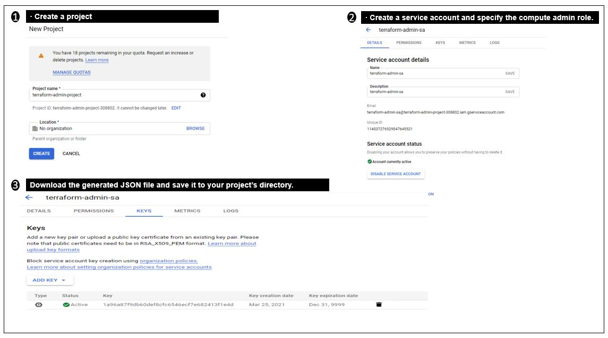
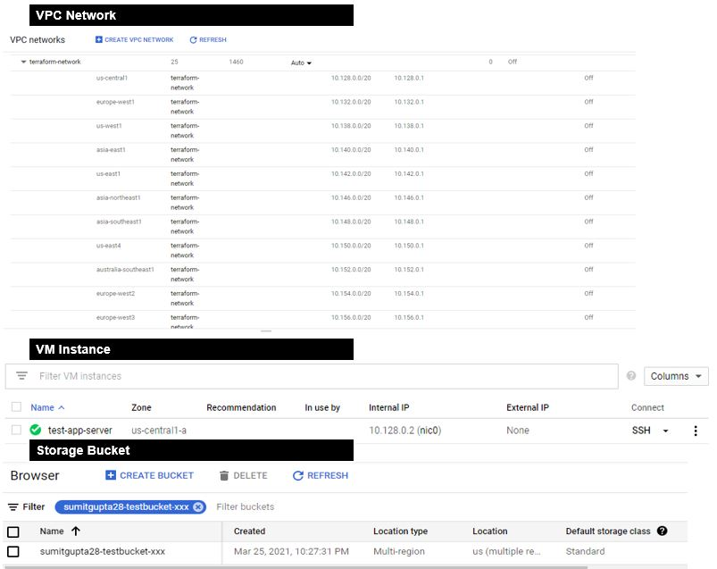

# Terraform on GCP (Google Cloud Platform)

## Setup GCP Project and Service Account 

GCP Setup for Terrafrom has below 3 steps. 

- Create a project 
- Create a service account and specify the compute admin role.
- Download the generated JSON file and save it to your project’s directory.



## Terraform Configuration 

Here is the configuration for setting up CGP Provider

```sh

    terraform {
    required_providers {
        google = {
        source  = "hashicorp/google"
        version = "3.5.0"
        }
    }
    }

    provider "google" {
    credentials = file(var.GCP_CRED_FILE_NAME)
    project     = var.GCP_PROJECT_ID
    region      = var.GCP_REGION
    zone        = var.GCP_ZONE
    }

```

and Variable values are 

```sh
    GCP_PROJECT_ID     = "weighty-wonder-308406"
    GCP_REGION         = "us-central1"
    GCP_ZONE           = "us-central1-a"
    GCP_CRED_FILE_NAME = "Terraform-project-b21d170ea375.json"
```


With this now we are ready to create GCP resources with Terrafrom. 


# Create first GCP Resource 

to Valdiate our configuration and to test below GCP resoruces we are going to create. 

```sh
    ## Create a VPC network
    resource "google_compute_network" "vpc_network" {
    name = "terraform-network"
    }

    ## Create a VM instance
    resource "google_compute_instance" "app-instance" {
    name         = "test-app-server"
    machine_type = "f1-micro"
    zone         = var.GCP_ZONE

    boot_disk {
        initialize_params {
        image = "debian-cloud/debian-9"
        }
    }

    network_interface {
        network = google_compute_network.vpc_network.id

    }
    }

    ## Create a storage bucket
    resource "google_storage_bucket" "test-bucket" {
    name = "sumitgupta28-testbucket-xxx"
    }
```


and if we perform **terrafrom init** , **terrafrom plan** and **terrafrom apply** , below apply outout will created a 
VPC network and VM Instance and a storage bucket. 

```sh

        $ terraform apply

        An execution plan has been generated and is shown below.
        Resource actions are indicated with the following symbols:
        + create

        Terraform will perform the following actions:

        # google_compute_instance.app-instance will be created
        + resource "google_compute_instance" "app-instance" {
            + can_ip_forward       = false
            + cpu_platform         = (known after apply)
            + deletion_protection  = false
            + guest_accelerator    = (known after apply)
            + id                   = (known after apply)
            + instance_id          = (known after apply)
            + label_fingerprint    = (known after apply)
            + machine_type         = "f1-micro"
            + metadata_fingerprint = (known after apply)
            + min_cpu_platform     = (known after apply)
            + name                 = "test-app-server"
            + project              = (known after apply)
            + self_link            = (known after apply)
            + tags_fingerprint     = (known after apply)
            + zone                 = "us-central1-a"

            + boot_disk {
                + auto_delete                = true
                + device_name                = (known after apply)
                + disk_encryption_key_sha256 = (known after apply)
                + kms_key_self_link          = (known after apply)
                + mode                       = "READ_WRITE"
                + source                     = (known after apply)

                + initialize_params {
                    + image  = "debian-cloud/debian-9"
                    + labels = (known after apply)
                    + size   = (known after apply)
                    + type   = (known after apply)
                    }
                }

            + network_interface {
                + name               = (known after apply)
                + network            = (known after apply)
                + network_ip         = (known after apply)
                + subnetwork         = (known after apply)
                + subnetwork_project = (known after apply)
                }

            + scheduling {
                + automatic_restart   = (known after apply)
                + on_host_maintenance = (known after apply)
                + preemptible         = (known after apply)

                + node_affinities {
                    + key      = (known after apply)
                    + operator = (known after apply)
                    + values   = (known after apply)
                    }
                }
            }

        # google_compute_network.vpc_network will be created
        + resource "google_compute_network" "vpc_network" {
            + auto_create_subnetworks         = true
            + delete_default_routes_on_create = false
            + gateway_ipv4                    = (known after apply)
            + id                              = (known after apply)
            + ipv4_range                      = (known after apply)
            + name                            = "terraform-network"
            + project                         = (known after apply)
            + routing_mode                    = (known after apply)
            + self_link                       = (known after apply)
            }

        # google_storage_bucket.test-bucket will be created
        + resource "google_storage_bucket" "test-bucket" {
            + bucket_policy_only = (known after apply)
            + force_destroy      = false
            + id                 = (known after apply)
            + location           = "US"
            + name               = "sumitgupta28-testbucket-xxx"
            + project            = (known after apply)
            + self_link          = (known after apply)
            + storage_class      = "STANDARD"
            + url                = (known after apply)
            }

        Plan: 3 to add, 0 to change, 0 to destroy.

        Do you want to perform these actions?
        Terraform will perform the actions described above.
        Only 'yes' will be accepted to approve.

        Enter a value: yes

        google_compute_network.vpc_network: Creating...
        google_storage_bucket.test-bucket: Creating...
        google_storage_bucket.test-bucket: Creation complete after 1s [id=sumitgupta28-testbucket-xxx]
        google_compute_network.vpc_network: Still creating... [10s elapsed]
        google_compute_network.vpc_network: Still creating... [20s elapsed]
        google_compute_network.vpc_network: Still creating... [30s elapsed]
        google_compute_network.vpc_network: Still creating... [40s elapsed]
        google_compute_network.vpc_network: Creation complete after 47s [id=projects/weighty-wonder-308406/global/networks/terraform-network]
        google_compute_instance.app-instance: Creating...
        google_compute_instance.app-instance: Still creating... [10s elapsed]
        google_compute_instance.app-instance: Creation complete after 16s [id=projects/weighty-wonder-308406/zones/us-central1-a/instances/test-app-server]

        Apply complete! Resources: 3 added, 0 changed, 0 destroyed.

```

