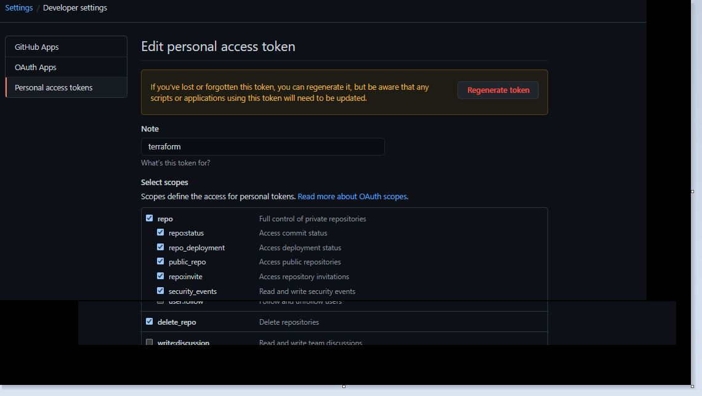

# How to Run 

## First Create a Git Hub Token


## Provide **token** as input to [git hub provider](https://registry.terraform.io/providers/integrations/github/latest/docs)

```
    provider "github" {
    # Configuration options
    token = var.github_token
    }
```

### Method#1 using terraform.tfvars
> Create a new file **terraform.tfvars** with below content inside the project folder

```sh
    github_token = "<<github_token>>"
```

### Method#2 using env variables.

```sh
export github_token="<<github_token>>"
```

### Method#3 input as var to terraform commands

```sh
terraform plan -var github_token="<<github_token>>"
terraform apply -var github_token="<<github_token>>" 
```

## Then run the plan command to see what resources its going to create
```sh
        $ terraform plan

        An execution plan has been generated and is shown below.
        Resource actions are indicated with the following symbols:
        + create

        Terraform will perform the following actions:

        # github_repository.terraform-repo-sumitgupta28 will be created
        + resource "github_repository" "terraform-repo-sumitgupta28" {
            + allow_merge_commit     = true
            + allow_rebase_merge     = true
            + allow_squash_merge     = true
            + archived               = false
            + default_branch         = (known after apply)
            + delete_branch_on_merge = false
            + description            = "created via terraform"
            + etag                   = (known after apply)
            + full_name              = (known after apply)
            + git_clone_url          = (known after apply)
            + html_url               = (known after apply)
            + http_clone_url         = (known after apply)
            + id                     = (known after apply)
            + name                   = "terraform-repo-sumitgupta28"
            + node_id                = (known after apply)
            + private                = (known after apply)
            + repo_id                = (known after apply)
            + ssh_clone_url          = (known after apply)
            + svn_url                = (known after apply)
            + visibility             = "public"
            }

        # github_repository.terraform-repo-sumitgupta28-test will be created
        + resource "github_repository" "terraform-repo-sumitgupta28-test" {
            + allow_merge_commit     = true
            + allow_rebase_merge     = true
            + allow_squash_merge     = true
            + archived               = false
            + default_branch         = (known after apply)
            + delete_branch_on_merge = false
            + description            = "created via terraform[terraform-repo-sumitgupta28-test]"
            + etag                   = (known after apply)
            + full_name              = (known after apply)
            + git_clone_url          = (known after apply)
            + html_url               = (known after apply)
            + http_clone_url         = (known after apply)
            + id                     = (known after apply)
            + name                   = "terraform-repo-sumitgupta28-test"
            + node_id                = (known after apply)
            + private                = (known after apply)
            + repo_id                = (known after apply)
            + ssh_clone_url          = (known after apply)
            + svn_url                = (known after apply)
            + visibility             = "public"
            }

        Plan: 2 to add, 0 to change, 0 to destroy.

        Changes to Outputs:
        + default_branch-1 = (known after apply)
        + default_branch-2 = (known after apply)
        + description-1    = "created via terraform"
        + description-2    = "created via terraform[terraform-repo-sumitgupta28-test]"
        + full_name-1      = (known after apply)
        + full_name-2      = (known after apply)
        + git_clone_url-1  = (known after apply)
        + git_clone_url-2  = (known after apply)

        ------------------------------------------------------------------------

        Note: You didn't specify an "-out" parameter to save this plan, so Terraform
        can't guarantee that exactly these actions will be performed if
        "terraform apply" is subsequently run.

```

## run the Apply command to create resources 
```sh
        $ terraform apply

        An execution plan has been generated and is shown below.  
        Resource actions are indicated with the following symbols:
        + create

        Terraform will perform the following actions:

        # github_repository.terraform-repo-sumitgupta28 will be created
        + resource "github_repository" "terraform-repo-sumitgupta28" {
            + allow_merge_commit     = true
            + allow_rebase_merge     = true
            + allow_squash_merge     = true 
            + archived               = false
            + default_branch         = (known after apply)
            + delete_branch_on_merge = false
            + description            = "created via terraform"
            + etag                   = (known after apply)
            + full_name              = (known after apply)
            + git_clone_url          = (known after apply)
            + html_url               = (known after apply)
            + http_clone_url         = (known after apply)
            + id                     = (known after apply)
            + name                   = "terraform-repo-sumitgupta28"
            + node_id                = (known after apply)
            + private                = (known after apply)
            + repo_id                = (known after apply)
            + ssh_clone_url          = (known after apply)
            + svn_url                = (known after apply)
            + visibility             = "public"
            }

        # github_repository.terraform-repo-sumitgupta28-test will be created
        + resource "github_repository" "terraform-repo-sumitgupta28-test" {
            + allow_merge_commit     = true
            + allow_rebase_merge     = true
            + allow_squash_merge     = true
            + archived               = false
            + default_branch         = (known after apply)
            + delete_branch_on_merge = false
            + description            = "created via terraform[terraform-repo-sumitgupta28-test]"
            + etag                   = (known after apply)
            + full_name              = (known after apply)
            + git_clone_url          = (known after apply)
            + html_url               = (known after apply)
            + http_clone_url         = (known after apply)
            + id                     = (known after apply)
            + name                   = "terraform-repo-sumitgupta28-test"
            + node_id                = (known after apply)
            + private                = (known after apply)
            + repo_id                = (known after apply)
            + ssh_clone_url          = (known after apply)
            + svn_url                = (known after apply)
            + visibility             = "public"
            }

        Plan: 2 to add, 0 to change, 0 to destroy.

        Changes to Outputs:
        + default_branch-1 = (known after apply)
        + default_branch-2 = (known after apply)
        + description-1    = "created via terraform"
        + description-2    = "created via terraform[terraform-repo-sumitgupta28-test]"
        + full_name-1      = (known after apply)
        + full_name-2      = (known after apply)
        + git_clone_url-1  = (known after apply)
        + git_clone_url-2  = (known after apply)

        Do you want to perform these actions?
        Terraform will perform the actions described above.
        Only 'yes' will be accepted to approve.

        Enter a value: yes

        github_repository.terraform-repo-sumitgupta28: Creating...
        github_repository.terraform-repo-sumitgupta28-test: Creating...
        github_repository.terraform-repo-sumitgupta28: Creation complete after 9s [id=terraform-repo-sumitgupta28]
        github_repository.terraform-repo-sumitgupta28-test: Creation complete after 10s [id=terraform-repo-sumitgupta28-test]

        Apply complete! Resources: 2 added, 0 changed, 0 destroyed.

        Outputs:
                
        default_branch-1 = "main"
        default_branch-2 = "main"
        description-1 = "created via terraform"
        description-2 = "created via terraform[terraform-repo-sumitgupta28-test]"
        full_name-1 = "sumitgupta28/terraform-repo-sumitgupta28"
        full_name-2 = "sumitgupta28/terraform-repo-sumitgupta28-test"   
        git_clone_url-1 = "git://github.com/sumitgupta28/terraform-repo-sumitgupta28.git"     
        git_clone_url-2 = "git://github.com/sumitgupta28/terraform-repo-sumitgupta28-test.git"
```

## run the destroy command to destroy the resources 

```sh
        $ terraform destroy -auto-approve
        github_repository.terraform-repo-sumitgupta28-test: Destroying... [id=terraform-repo-sumitgupta28-test]
        github_repository.terraform-repo-sumitgupta28: Destroying... [id=terraform-repo-sumitgupta28]
        github_repository.terraform-repo-sumitgupta28-test: Destruction complete after 0s
        github_repository.terraform-repo-sumitgupta28: Destruction complete after 1s

        Destroy complete! Resources: 2 destroyed.
```
