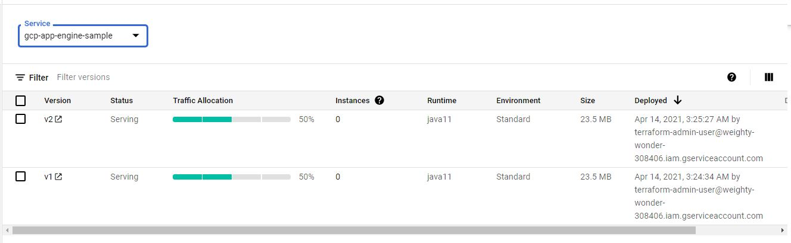

# Terraform on GCP (Google Cloud Platform)

[App Engine](https://cloud.google.com/appengine) is a Platform-as-a-Service ("PaaS") offering. The App Engine platform manages the hardware and networking infrastructure required to run your code. App Engine provides built-in services that many web applications need. 


## [Setup GCP Project and Service Account](../01-gcp-setup/README.md) 

## Create a bucket to store the src code.

- This is going to create a bucket and 
- Copy the code.zip from /code-zip folder to the newly created bucket. 

```sh

   variable "GCP_BUCKET_NAME" {
    default = "sumitgupta28-code-bucket"
    }

    resource "google_storage_bucket" "code-bucket" {
    name                        = var.GCP_BUCKET_NAME
    storage_class               = "NEARLINE"
    location                    = "US" ## multi Region
    force_destroy               = true
    project                     = var.GCP_PROJECT_ID
    uniform_bucket_level_access = true
    }

    resource "google_storage_bucket_object" "application-zip-copy" {
    name   = "code-zip.zip"
    source = "code-zip/code-zip.zip"
    bucket = var.GCP_BUCKET_NAME
    depends_on = [
        google_storage_bucket.code-bucket
    ]
    }

```


## Deploy the same code with 2 versions.

```sh
    
    resource "google_app_engine_standard_app_version" "gcp-app-engine-sample-v1" {
    version_id = "v1"
    service    = "gcp-app-engine-sample"
    runtime    = "java11"
    project    = var.GCP_PROJECT_ID
    deployment {

        zip {
        source_url = "https://storage.googleapis.com/${google_storage_bucket.code-bucket.name}/${google_storage_bucket_object.application-zip-copy.name}"
        }
    }
    delete_service_on_destroy = true
    }

    resource "google_app_engine_standard_app_version" "gcp-app-engine-sample-v2" {
    version_id = "v2"
    service    = "gcp-app-engine-sample"
    runtime    = "java11"
    project    = var.GCP_PROJECT_ID
    deployment {

        zip {
        source_url = "https://storage.googleapis.com/${google_storage_bucket.code-bucket.name}/${google_storage_bucket_object.application-zip-copy.name}"
        }
    }
    delete_service_on_destroy = true
    }

```


## 50/50% Traffic between the services

```sh

    resource "google_app_engine_service_split_traffic" "liveapp" {
    service = google_app_engine_standard_app_version.gcp-app-engine-sample-v2.service

    migrate_traffic = false
    split {
        shard_by = "RANDOM"
        allocations = {
        (google_app_engine_standard_app_version.gcp-app-engine-sample-v1.version_id) = 0.50
        (google_app_engine_standard_app_version.gcp-app-engine-sample-v2.version_id) = 0.50
        }
    }
    }
```



## Services List

```sh

    $ gcloud app services list
    SERVICE                NUM_VERSIONS
    default                1
    gcp-app-engine-sample  2

```

## get the urls for service **gcp-app-engine-sample**

```sh

    $ gcloud app browse -s gcp-app-engine-sample
    Did not detect your browser. Go to this link to view your app:
    https://gcp-app-engine-sample-dot-gcp-learning-project-312006.wl.r.appspot.com

    $ gcloud app browse -s gcp-app-engine-sample --version v1
    Did not detect your browser. Go to this link to view your app:
    https://v1-dot-gcp-app-engine-sample-dot-gcp-learning-project-312006.wl.r.appspot.com

    $ gcloud app browse -s gcp-app-engine-sample --version v2
    Did not detect your browser. Go to this link to view your app:
    https://v2-dot-gcp-app-engine-sample-dot-gcp-learning-project-312006.wl.r.appspot.com

```

## Test the services 

```sh

$curl https://v1-dot-gcp-app-engine-sample-dot-gcp-learning-project-312006.wl.r.appspot.com/api/health
App is Healthy : app.version:v1

$ curl https://v2-dot-gcp-app-engine-sample-dot-gcp-learning-project-312006.wl.r.appspot.com/api/health
App is Healthy : app.version:v1

```


## Finally Destory 
```sh

    $ terraform destroy -auto-approve
    google_app_engine_service_split_traffic.liveapp: Destroying... [id=apps/gcp-learning-project-312006/services/gcp-app-engine-sample]
    google_app_engine_service_split_traffic.liveapp: Destruction complete after 0s
    google_app_engine_standard_app_version.gcp-app-engine-sample-v2: Destroying... [id=apps/gcp-learning-project-312006/services/gcp-app-engine-sample/versions/v2]
    google_app_engine_standard_app_version.gcp-app-engine-sample-v1: Destroying... [id=apps/gcp-learning-project-312006/services/gcp-app-engine-sample/versions/v1]
    google_app_engine_standard_app_version.gcp-app-engine-sample-v2: Still destroying... [id=apps/gcp-learning-project-312006/services/gcp-app-engine-sample/versions/v2, 10s elapsed]
    google_app_engine_standard_app_version.gcp-app-engine-sample-v1: Still destroying... [id=apps/gcp-learning-project-312006/services/gcp-app-engine-sample/versions/v1, 10s elapsed]
    google_app_engine_standard_app_version.gcp-app-engine-sample-v2: Destruction complete after 12s
    google_app_engine_standard_app_version.gcp-app-engine-sample-v1: Destruction complete after 13s
    google_storage_bucket_object.application-zip-copy: Destroying... [id=sumitgupta28-code-bucket-code-zip.zip]
    google_storage_bucket_object.application-zip-copy: Destruction complete after 0s
    google_storage_bucket.code-bucket: Destroying... [id=sumitgupta28-code-bucket]
    google_storage_bucket.code-bucket: Destruction complete after 0s

    Destroy complete! Resources: 5 destroyed.

```

## Url Naming 

### Url Naming - default Service url

```
    https://gcp-learning-project-312006.wl.r.appspot.com/api/health
    
    https://<<project-name>>.<<region-id>>.r.appspot.com/<<APP_URI>>
```

### Url Naming - with service name
```
    https://gcp-app-engine-sample-dot-gcp-learning-project-312006.wl.r.appspot.com/api/health
    
    https://<<service-name>>-dot-<<project-name>>.<<region-id>>.r.appspot.com/<<APP_URI>>

```


### Url Naming - with version and service name
```
    https://v2-dot-gcp-app-engine-sample-dot-gcp-learning-project-312006.wl.r.appspot.com/api/health
    
    https://<<version>>-dot-<<service-name>>-dot-<<project-name>>.<<region-id>>.r.appspot.com/<<APP_URI>>

```


## Extra.. 
[link](https://github.com/sumitgupta28/gcp-local-validation/tree/master/gcp-app-engine-sample#readme) for application used to for deployment 

