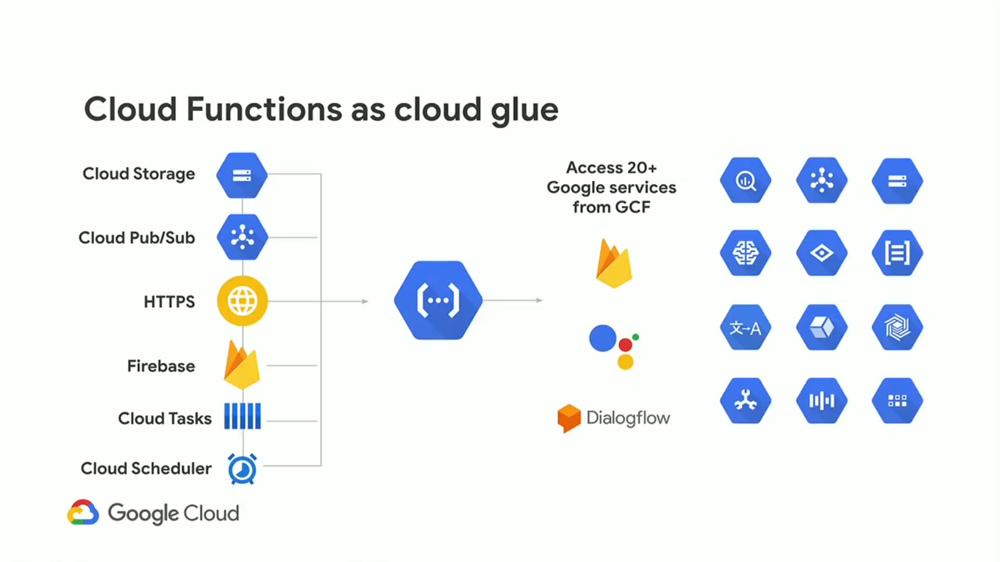
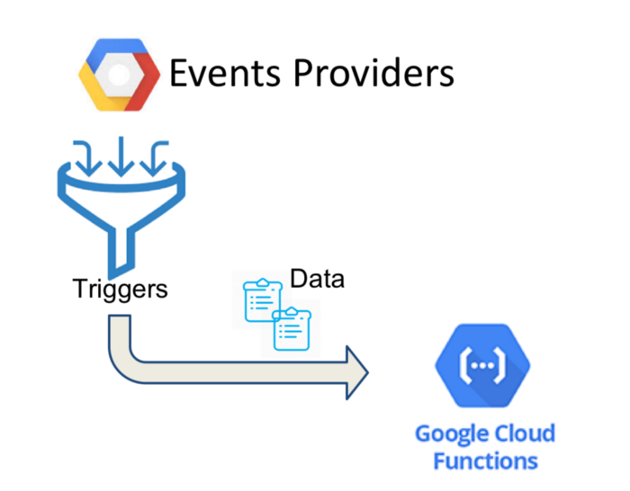
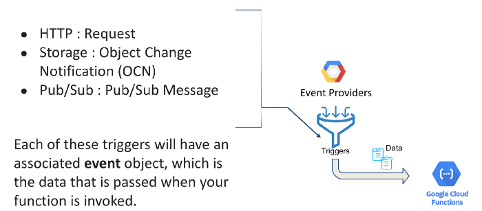

# Terraform on GCP (Google Cloud Platform)

### [Cloud Functions](https://cloud.google.com/functions)

- Google Cloud Functions is a serverless execution environment for building and connecting cloud services. 
- With Cloud Functions you write simple, single-purpose functions that are attached to events emitted from your cloud infrastructure and services. 
- Your Cloud Function is triggered when an event being watched is fired. Your code executes in a fully managed environment. There is no need to provision any infrastructure or worry about managing any servers.
- Code executes in a fully managed environment and no need to provision any infrastructure.
- Single-purpose functions
- Attached to events emitted from your cloud infrastructure and services and triggered when an event being watched is fired:



## [Setup GCP Project and Service Account](../01-gcp-setup/README.md) 

## Create a bucket and copy the code needs to be run on execution. 

```sh

    resource "google_storage_bucket" "code-bucket" {
    name                        = var.GCP_BUCKET_NAME
    storage_class               = "NEARLINE"
    location                    = "US" ## multi Region
    force_destroy               = true
    project                     = var.GCP_PROJECT_ID
    uniform_bucket_level_access = true
    }
    resource "google_storage_bucket_object" "application-zip-copy" {
    name   = "pubsub-function.zip"
    source = "code-zip/pubsub-function.zip"
    bucket = var.GCP_BUCKET_NAME
    depends_on = [
        google_storage_bucket.code-bucket
    ]
    }

```

## Create a topic where messages are going to land  

```sh
   resource "google_pubsub_topic" "pub-sub-transaction-topic" {
    name = "transaction-topic"

    labels = {
        name = "transaction-topic"
    }
    }
```

## Create a function which keep eye on messages coming on topic and run the entry point code as soon as message arrives. 
```sh

   resource "google_cloudfunctions_function" "function-test-pubsub-topic" {
    name        = "function-test-pubsub-topic"
    description = "Pub Sub topic Message Print"
    runtime     = "java11"

    timeout = 60
    entry_point           = "com.demo.gcp.GcpPubSubFunctionDemoApplication"
    max_instances = 1
    source_archive_bucket     = google_storage_bucket.code-bucket.name
    source_archive_object     = google_storage_bucket_object.application-zip-copy.name

    event_trigger {
        event_type = "google.pubsub.topic.publish"
        resource = google_pubsub_topic.pub-sub-transaction-topic.id
    }
    available_memory_mb   = 128

    depends_on = [
        google_storage_bucket_object.application-zip-copy
    ]
    }

    # IAM entry for all users to invoke the function
    resource "google_cloudfunctions_function_iam_member" "invoker" {
    project        = google_cloudfunctions_function.function-test-pubsub-topic.project
    region         = google_cloudfunctions_function.function-test-pubsub-topic.region
    cloud_function = google_cloudfunctions_function.function-test-pubsub-topic.name

    role   = "roles/cloudfunctions.invoker"
    member = "allUsers"
    }
```





