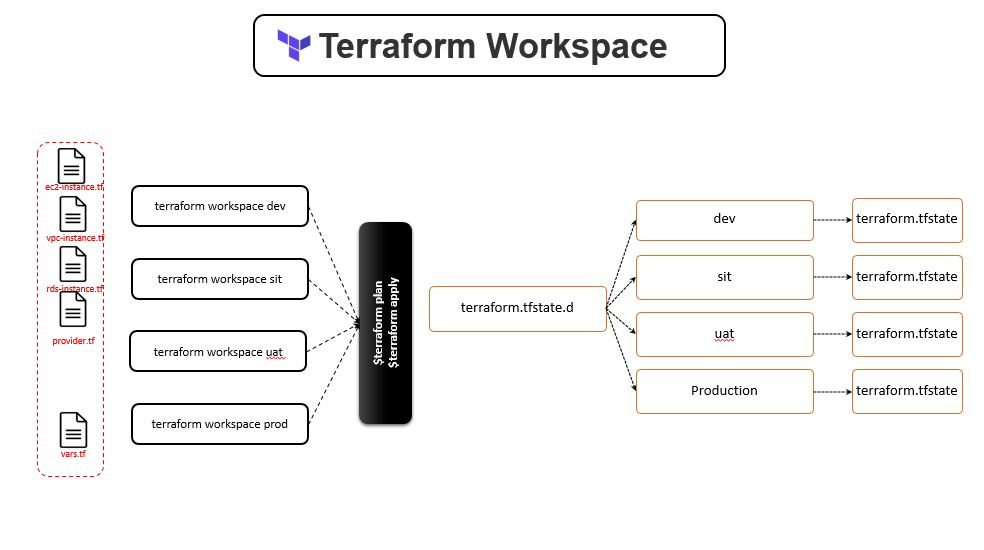

### terraform workspace

Terraform workspace allows to manage/store seprate env spepcific [like dev/uat/prod] state for the resources created with single set of parameterized configuration files. 

As our main goal is to have the same infrastructre created for all the enviroments using single set of configuration files. we might have some difference in enviorment like they can be in different region, or using different accounts. 

**The persistent data stored in the backend belongs to a workspace. Initially the backend has only one workspace, called "default", and thus there is only one Terraform state associated with that configuration.**




In this example we will be having 3 workspaces dev , uat and prod and 3 different tfvar files dev.tfvars,uat.tfvars and prod.tfvars 

#### Workspace commands

        $ terraform workspace
        Usage: terraform workspace

        new, list, show, select and delete Terraform workspaces.

#### Workspace commands - list

 list the available workspace.

        $ terraform workspace list
        * default

#### Workspace commands - show

show the current workspace name

        $ terraform workspace show
        default

        $ terraform workspace show
        prod

#### Workspace commands - new

Create a new workspace and select it.

        $ terraform workspace new dev
        Created and switched to workspace "dev"!

        You're now on a new, empty workspace. Workspaces isolate their state,
        so if you run "terraform plan" Terraform will not see any existing state
        for this configuration.

        $ terraform workspace list
        default
        * dev    

        $ terraform workspace new uat
        Created and switched to workspace "uat"!

        You're now on a new, empty workspace. Workspaces isolate their state,
        so if you run "terraform plan" Terraform will not see any existing state
        for this configuration.

        $ terraform workspace list
        default
        dev
        * uat

        $ terraform workspace new prod
        Created and switched to workspace "prod"!

        You're now on a new, empty workspace. Workspaces isolate their state,
        so if you run "terraform plan" Terraform will not see any existing state
        for this configuration.

        $ terraform workspace list
        default
        dev
        * prod
        uat

This will also create seprate directories to store the env specific state     
        
        $ tree terraform.tfstate.d
        terraform.tfstate.d
        |-- dev
        |-- prod
        `-- uat

#### Workspace commands - select

select option allows to select the specific workspace 

        $ terraform workspace list
        default
        dev    
        * prod   
        uat    

        $ terraform workspace select dev
        Switched to workspace "dev".

        $ terraform workspace list
        default
        * dev
        prod
        uat

**lets apply it on dev work space.**


        $ terraform apply -var-file dev.tfvars 
        .
        .
        .
        .
        Plan: 3 to add, 0 to change, 0 to destroy.

        Changes to Outputs:
        + back-end-arn        = (known after apply)
        + back-end-public_ip  = (known after apply)
        + back-end-tags       = {
            + "Name"      = "back-end-dev-instance"
            + "component" = "backend"
            }
        + front-end-arn       = (known after apply)
        + front-end-public_ip = (known after apply)
        + front-end-tags      = {
            + "Name"      = "front-end-dev-instance"
            + "component" = "frontend"
            }

        Do you want to perform these actions in workspace "dev"?
        Terraform will perform the actions described above.
        Only 'yes' will be accepted to approve.

        Enter a value: yes

        .
        .
        .
        .

        Apply complete! Resources: 3 added, 0 changed, 0 destroyed.

        Outputs:

        back-end-ami = "ami-0915bcb5fa77e4892"
        back-end-arn = "arn:aws:ec2:us-east-1:119956859268:instance/i-06dc4fd0f29b83442"
        back-end-public_ip = "54.90.106.194"
        back-end-tags = tomap({
        "Name" = "back-end-dev-instance"
        "component" = "backend"
        })
        front-end-ami = "ami-0915bcb5fa77e4892"
        front-end-arn = "arn:aws:ec2:us-east-1:119956859268:instance/i-0cd8d4c833cba8458"
        front-end-public_ip = "54.83.100.110"
        front-end-tags = tomap({
        "Name" = "front-end-dev-instance"
        "component" = "frontend"
        })

As we can see here the tags for the both the instance has dev word appended. Also dev workspace state is stored in terraform.tfstate.d/dev folder.

        $ tree terraform.tfstate.d
        terraform.tfstate.d
        |-- dev
        |   `-- terraform.tfstate
        |-- prod
        `-- uat

**Change the workspace to uat and apply.**


        $ terraform workspace select uat
        Switched to workspace "uat".

        $ terraform apply -var-file uat.tfvars 
        .
        .
        .
        Plan: 3 to add, 0 to change, 0 to destroy.

        Changes to Outputs:
        + back-end-ami        = "ami-09246ddb00c7c4fef"
        + back-end-arn        = (known after apply)
        + back-end-public_ip  = (known after apply)
        + back-end-tags       = {
            + "Name"      = "back-end-uat-instance"
            + "component" = "backend"
            }
        + front-end-ami       = "ami-09246ddb00c7c4fef"
        + front-end-arn       = (known after apply)
        + front-end-public_ip = (known after apply)
        + front-end-tags      = {
            + "Name"      = "front-end-uat-instance"
            + "component" = "frontend"
            }

        Do you want to perform these actions in workspace "uat"?
        Terraform will perform the actions described above.
        Only 'yes' will be accepted to approve.

        Enter a value: yes

        .
        .
        .

        Apply complete! Resources: 3 added, 0 changed, 0 destroyed.

        Outputs:

        back-end-ami = "ami-09246ddb00c7c4fef"
        back-end-arn = "arn:aws:ec2:us-east-2:119956859268:instance/i-068bd96e2621acb03"
        back-end-public_ip = "3.141.12.209"
        back-end-tags = tomap({
        "Name" = "back-end-uat-instance"
        "component" = "backend"
        })
        front-end-ami = "ami-09246ddb00c7c4fef"
        front-end-arn = "arn:aws:ec2:us-east-2:119956859268:instance/i-02c03cc4c6ef2a02e"
        front-end-public_ip = "18.191.84.194"
        front-end-tags = tomap({
        "Name" = "front-end-uat-instance"
        "component" = "frontend"
        })

here differnt region/ami is selected based on -var-file also the intance name appended with uat.

and seprate state for uat


    $ tree terraform.tfstate.d/
    terraform.tfstate.d/
    |-- dev
    |   |-- terraform.tfstate       
        |-- prod
    `-- uat
        `-- terraform.tfstate

    3 directories, 2 files 

#### Workspace commands - delete

- **delete prod workspace** - yes we can dleete it as there is no state stored.
- **delete uat workspace** - can;t delete and we have state stored, so we need to destory the resources then delete it.
- **Before applying destroy**, select the correct workspace. 
- **Before applying workspace delete**, make sure workspace to be delete is not active.
- default workspace can not be deleted

```
    $ terraform workspace delete prod
    Deleted workspace "prod"!

    $ terraform workspace delete uat
    Workspace "uat" is not empty.

    Deleting "uat" can result in dangling resources: resources that
    exist but are no longer manageable by Terraform. Please destroy
    these resources first.  If you want to delete this workspace
    anyway and risk dangling resources, use the '-force' flag.

    $ terraform workspace select uat
    Switched to workspace "uat".

    $ terraform destroy -var-file uat.tfvars 
    .
    .
    .
        
    Do you really want to destroy all resources in workspace "uat"?
    Terraform will destroy all your managed infrastructure, as shown above.
    There is no undo. Only 'yes' will be accepted to confirm.

    Enter a value: yes
    .
    .
    .
    Destroy complete! Resources: 3 destroyed.

    $ terraform workspace delete uat
    Workspace "uat" is your active workspace.

    You cannot delete the currently active workspace. Please switch
    to another workspace and try again.

    $ terraform workspace select default
    Switched to workspace "default".

    $ terraform workspace delete uat
    Deleted workspace "uat"!
```