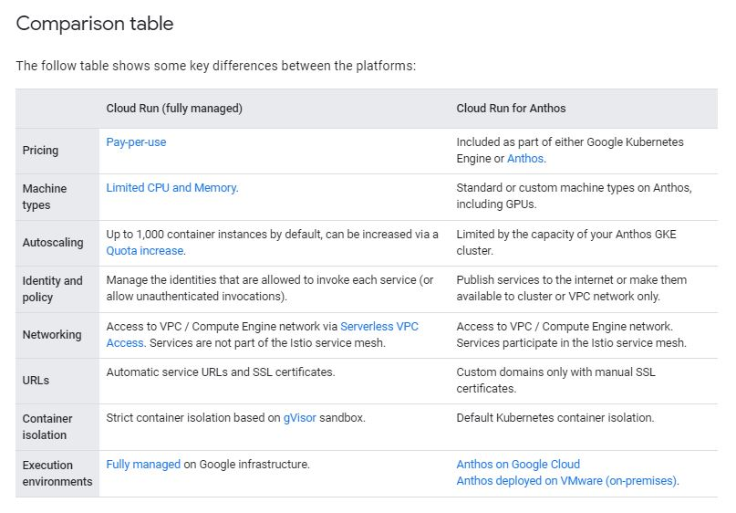

# Terraform on GCP (Google Cloud Platform)


## [Cloud Run (fully managed)](https://cloud.google.com/kuberun/docs/choosing-a-platform#cloud-run-fully-managed)

The Cloud Run (fully managed) platform allows you to deploy stateless containers without having to worry about the underlying infrastructure. Your workloads are automatically scaled out or in to zero depending on the traffic to your app. You only pay when your app is running, billed to the nearest 100 milliseconds.

## [Cloud Run for Anthos](https://cloud.google.com/kuberun/docs/choosing-a-platform#cloud-run-for-anthos)

Cloud Run for Anthos abstracts away complex Kubernetes concepts, allowing developers to easily leverage the benefits of Kubernetes and serverless together. It provides access to custom machine types, additional networking support, and Cloud Accelerators. It allows you to run your workloads on-premises or on Google Cloud.

## [Comparison table](https://cloud.google.com/kuberun/docs/choosing-a-platform#comparison_table)




## Create docker image and push to Google Container Registry. [google-container-registry](https://cloud.google.com/container-registry/docs/pushing-and-pulling)

Here we are going to clone my demo application from git and create an image for ocp-demo app

```
    $ git clone https://github.com/sumitgupta28/k8s-demo-app.git

    $ cd k8s-demo-app/ocp-demo-app

    $ docker build . -t us.gcr.io/weighty-wonder-308406/docker-sample-app:v1

    $ docker images
    REPOSITORY                                          TAG                IMAGE ID       CREATED         SIZE
    us.gcr.io/weighty-wonder-308406/docker-sample-app   v1                 8d226d2b52b8   2 minutes ago   290MB

    $ docker push us.gcr.io/weighty-wonder-308406/docker-sample-app:v1
    The push refers to repository [us.gcr.io/weighty-wonder-308406/docker-sample-app]
    5b1bed977204: Pushed
    c4cbea964368: Pushed
    8177b5e86a0f: Pushed
    65d6dc8a8316: Pushed
    a42439ce9650: Layer already exists
    26270c5e25fa: Layer already exists
    e2c6ff462357: Layer already exists
    v1: digest: sha256:ea7735cad5891cd442db0f4fdb7027da23a944152a51503391ece67331d4a13f size: 1793

```

Created another version of this app by updateding the version at /k8s-demo-app/ocp-demo-app/src/main/resources/application.yml

```sh

    $ docker push us.gcr.io/weighty-wonder-308406/docker-sample-app:v2
    The push refers to repository [us.gcr.io/weighty-wonder-308406/docker-sample-app]
    4d1b37d4b199: Pushed
    c4cbea964368: Layer already exists
    8177b5e86a0f: Layer already exists
    65d6dc8a8316: Layer already exists
    a42439ce9650: Layer already exists
    26270c5e25fa: Layer already exists
    e2c6ff462357: Layer already exists
    v2: digest: sha256:8fab095903e760793211d7d6676408dc4594c1021b236a0db4ea67aa221d5091 size: 1793

    $ docker images | grep us.gcr
    us.gcr.io/weighty-wonder-308406/docker-sample-app   v2                 b984deef9c4e   2 minutes ago    290MB
    us.gcr.io/weighty-wonder-308406/docker-sample-app   v1                 8d226d2b52b8   11 minutes ago   290MB

```

### See the images using gcloud container images command.

```sh

    $ gcloud container images list --repository=us.gcr.io/weighty-wonder-308406
    NAME
    us.gcr.io/weighty-wonder-308406/docker-sample-app

```

## [Setup GCP Project and Service Account](../01-gcp-setup/README.md) 

## Cloud run Service configuration fully managed with no auth.

```sh

    resource "google_cloud_run_service" "docker-sample-app" {
    name     = "docker-sample-app-service"
    location = var.GCP_REGION
    project  = var.GCP_PROJECT_ID

    template {
        spec {
        containers {
            image = "us.gcr.io/weighty-wonder-308406/docker-sample-app@sha256:8fab095903e760793211d7d6676408dc4594c1021b236a0db4ea67aa221d5091"
        }
        }
        metadata {
        name = "docker-sample-app-service-green"
        }
    }
    metadata {
        annotations = {
        generated-by = "terraform"
        }
    }
    traffic {
        percent         = 100
        latest_revision = true
    }
    }

    ### this for Cloud Run Service with Noauth
    data "google_iam_policy" "docker-sample-app-noauth" {
    binding {
        role = "roles/run.invoker"
        members = [
        "allUsers",
        ]
    }
    }

    resource "google_cloud_run_service_iam_policy" "docker-sample-app-noauth-iam-policy" {
    location = google_cloud_run_service.docker-sample-app.location
    project  = google_cloud_run_service.docker-sample-app.project
    service  = google_cloud_run_service.docker-sample-app.name

    policy_data = data.google_iam_policy.docker-sample-app-noauth.policy_data
    }

```

## let apply this change 

```sh
    $ terraform apply -auto-approve
    google_cloud_run_service.docker-sample-app: Creating...
    google_cloud_run_service.docker-sample-app: Still creating... [10s elapsed]
    google_cloud_run_service.docker-sample-app: Still creating... [20s elapsed]
    google_cloud_run_service.docker-sample-app: Creation complete after 28s [id=locations/us-central1/namespaces/weighty-wonder-308406/services/docker-sample-app-service]
    google_cloud_run_service_iam_policy.docker-sample-app-noauth-iam-policy: Creating...
    google_cloud_run_service_iam_policy.docker-sample-app-noauth-iam-policy: Creation complete after 1s [id=v1/projects/weighty-wonder-308406/locations/us-central1/services/docker-sample-app-service]

    Apply complete! Resources: 2 added, 0 changed, 0 destroyed.

    Outputs:

    status = "https://docker-sample-app-service-rw3qaxgcaq-uc.a.run.app"

```

### validate the url 

```sh
    $ curl https://docker-sample-app-service-rw3qaxgcaq-uc.a.run.app
    App is Healthy[Default Service] : v2, [localhost]


    $ curl https://docker-sample-app-service-rw3qaxgcaq-uc.a.run.app/api/hello
    hello OCP


    $ curl https://docker-sample-app-service-rw3qaxgcaq-uc.a.run.app/api/health
    Response from HostName : localhostApp is Healthy : v2
```

### validate with gcloud commands

```sh

    $ gcloud run services list
    Please choose a target platform:
    [1] Cloud Run (fully managed)
    [2] Cloud Run for Anthos deployed on Google Cloud
    [3] Cloud Run for Anthos deployed on VMware
    [4] cancel
    Please enter your numeric choice:  1

    To specify the platform yourself, pass `--platform managed`. Or, to make this the default target platform, run `gcloud config set run/platform managed`.

    SERVICE                    REGION       URL                                                        LAST DEPLOYED BY             LAST DEPLOYED AT
    ✔  docker-sample-app-service  us-central1  https://docker-sample-app-service-rw3qaxgcaq-uc.a.run.app  terraform-sa@weighty-wonder-308406.iam.gserviceaccount.com  2021-04-18T01:43:43.137605Z

    $ gcloud run revisions  list  --platform managed --region=us-central1
    REVISION                         ACTIVE  SERVICE                    DEPLOYED                 DEPLOYED BY
    ✔  docker-sample-app-service-green  yes     docker-sample-app-service  2021-04-18 01:43:23 UTC  terraform-sa@weighty-wonder-308406.iam.gserviceaccount.com

```


### Clean up [destory]

```sh
    $ terraform destroy -auto-approve
    google_cloud_run_service_iam_policy.docker-sample-app-noauth-iam-policy: Destroying... [id=v1/projects/weighty-wonder-308406/locations/us-central1/services/docker-sample-app-service]
    google_cloud_run_service_iam_policy.docker-sample-app-noauth-iam-policy: Destruction complete after 1s
    google_cloud_run_service.docker-sample-app: Destroying... [id=locations/us-central1/namespaces/weighty-wonder-308406/services/docker-sample-app-service]
    google_cloud_run_service.docker-sample-app: Destruction complete after 1s

    Destroy complete! Resources: 2 destroyed.
```

### Valdiation post Cleanup 

```sh

    $ gcloud run revisions  list  --platform managed --region=us-central1
    Listed 0 items.

    $ gcloud run services list  --platform managed
    Listed 0 items.

```