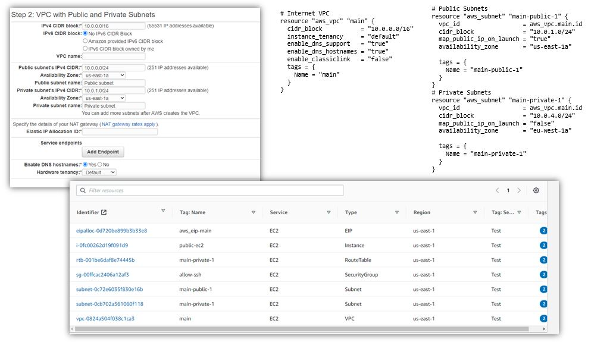

# How to Run 

## [Generate a key pair with name "mykey"](../generate-key-pair.md)

## [Set AWS Credentials](../provide-aws-cred-input.md) 

## Then run the plan command to see what resources its going to create
```sh
$terraform plan
```

## run the Apply command to create resources 
```sh
$terraform apply -auto-approve
```


