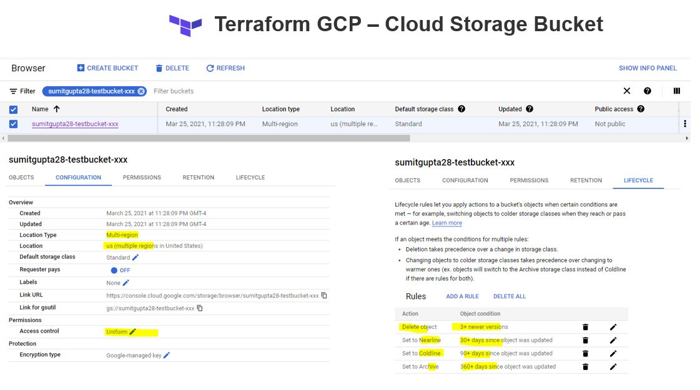

# Terraform on GCP (Google Cloud Platform)

## [Setup GCP Project and Service Account](../01-gcp-setup/README.md) 

## Create a Cloud Storage Bucket

Terrafrom Configuration
```sh

        ## Create a storage bucket
        resource "google_storage_bucket" "test-bucket" {
        name          = "sumitgupta28-testbucket-xxx"
        location      = "US" ## multi Region
        force_destroy = true

        uniform_bucket_level_access = true

        ## Delete it after 3 revisions   
        lifecycle_rule {
            condition {
            num_newer_versions = 3
            }
        action {
            type = "Delete"
        }
        }
        ## Move to NearLine post 30 days
        lifecycle_rule {
        condition {
            age = 30
        }
        action {
            type = "SetStorageClass"
            storage_class = "NEARLINE"
        }
        }
        ## Move to Coldline post 90 days
        lifecycle_rule {
        condition {
            age = 90
        }
        action {
            type = "SetStorageClass"
            storage_class = "COLDLINE"
        }
        }

        ## Move to Archive post 360 days

        lifecycle_rule {
        condition {
            age = 360
        }
        action {
            type = "SetStorageClass"
            storage_class = "ARCHIVE"
        }
        }
        

        }

```


```sh
    $ terraform plan

    An execution plan has been generated and is shown below.
    Resource actions are indicated with the following symbols:
    + create

    Terraform will perform the following actions:

    # google_storage_bucket.test-bucket will be created
    + resource "google_storage_bucket" "test-bucket" {
        + bucket_policy_only          = (known after apply)
        + force_destroy               = true
        + id                          = (known after apply)
        + location                    = "US"
        + name                        = "sumitgupta28-testbucket-xxx"
        + project                     = (known after apply)
        + self_link                   = (known after apply)
        + storage_class               = "STANDARD"
        + uniform_bucket_level_access = true
        + url                         = (known after apply)

        + lifecycle_rule {
            + action {
                + type = "Delete"
                }

            + condition {
                + matches_storage_class = []
                + num_newer_versions    = 3
                + with_state            = (known after apply)
                }
            }
        + lifecycle_rule {
            + action {
                + storage_class = "NEARLINE"
                + type          = "SetStorageClass"
                }

            + condition {
                + age                   = 30
                + matches_storage_class = []
                + with_state            = (known after apply)
                }
            }
        + lifecycle_rule {
            + action {
                + storage_class = "COLDLINE"
                + type          = "SetStorageClass"
                }

            + condition {
                + age                   = 90
                + matches_storage_class = []
                + with_state            = (known after apply)
                }
            }
        + lifecycle_rule {
            + action {
                + storage_class = "ARCHIVE"
                + type          = "SetStorageClass"
                }

            + condition {
                + age                   = 360
                + matches_storage_class = []
                + with_state            = (known after apply)
                }
            }
        }

    Plan: 1 to add, 0 to change, 0 to destroy.

    ------------------------------------------------------------------------

    Note: You didn't specify an "-out" parameter to save this plan, so Terraform
    can't guarantee that exactly these actions will be performed if
    "terraform apply" is subsequently run.


    $ terraform apply --auto-approve
    google_storage_bucket.test-bucket: Creating...
    google_storage_bucket.test-bucket: Creation complete after 2s [id=sumitgupta28-testbucket-xxx]

```
## Verify the bucket in Console


