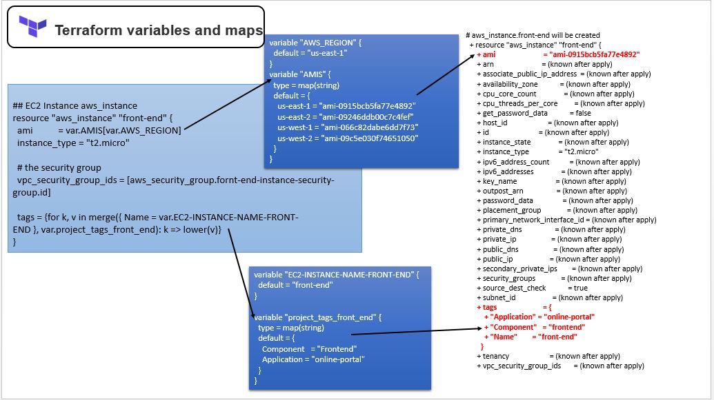
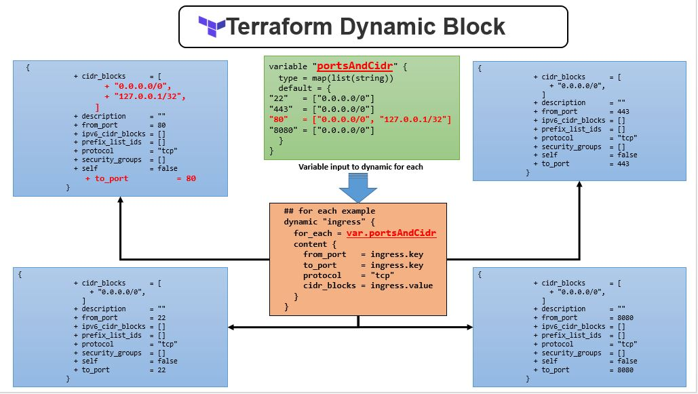
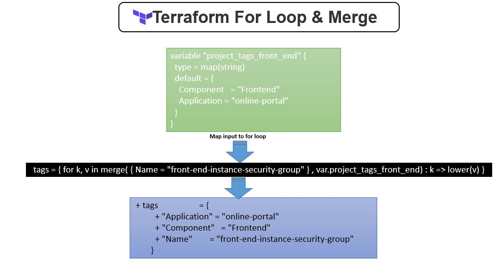
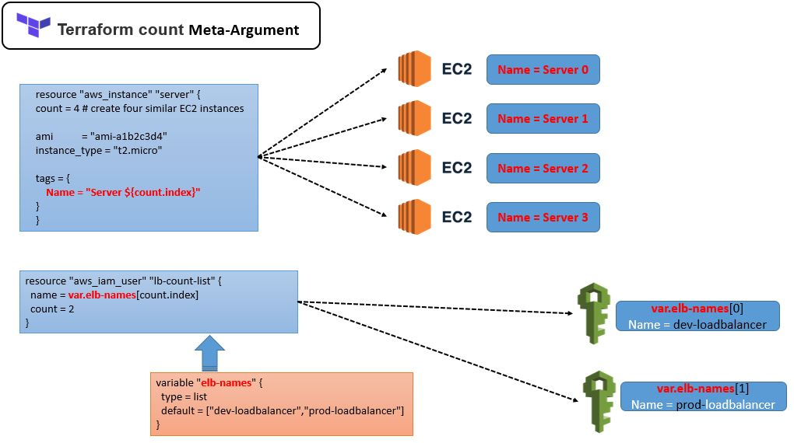
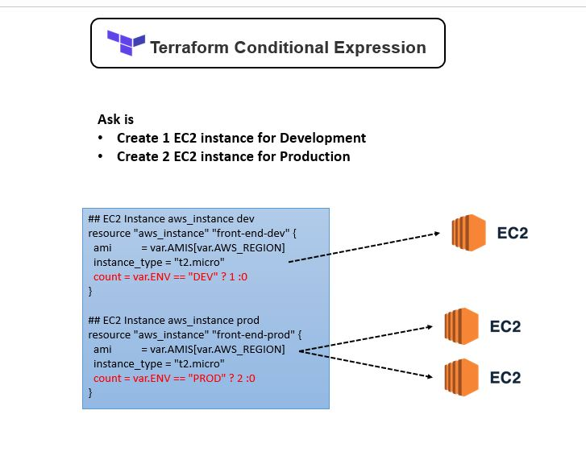
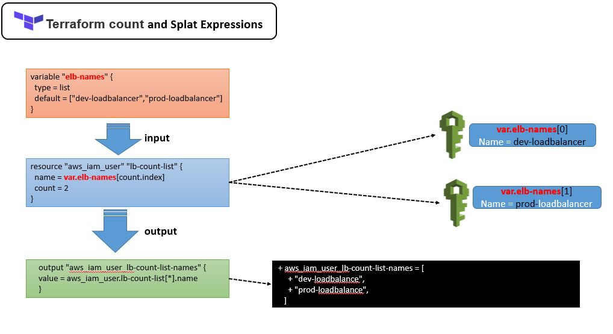

# How to Run 

Once you are in this directory [02-variables]. 

> Create a new file **terraform.tfvars** with below content 
```note
AWS_ACCESS_KEY = "<<YOUR_AWS_ACCESS_KEY>>"
AWS_SECRET_KEY = "<<YOUR_AWS_SECRET_KEY>>" 
```

## Running the Plan and generating the Plan file.


### with default values.

Then run the plan command to see what resources its going to create

```sh
    terraform plan -out default-variable.plan
```

Once done it will generate [default-variable.plan](default-variable.plan) , here all the variables values are picked up 
from [terraform.tfvars](terraform.tfvars).

'''sh
    $ terraform show -json default-variable.plan
'''

### with enviroment variables.


```sh
  terraform plan -var "EC2-INSTANCE-NAME-FRONT-END=front-end-instance" -out variable-with-external-variable.plan
```

Once done it will generate [variable-with-external-variable.plan](variable-with-external-variable.plan) , here all the variables values are picked up from [terraform.tfvars](terraform.tfvars) except the "EC2-INSTANCE-NAME-FRONT-END" which is provided as enviroment variable. 

'''sh
    $ terraform show -json variable-with-external-variable.plan 
'''


In the plan you will also see the how the variables and maps are used.




## dynamic block with for-each

In the plan you will also see the dynamic block with for-each is used to create ingress for security group.



## for-loop

In the plan you will also see the  for-loop is used to create tags.




## How to Assign Values from the Root Module:

1. Through commands on the CLI_

```sh
  $ terraform plan -var "EC2_INSTANCE_NAME_FRONT_END=front-end-instance" -target aws_instance.front-end
  
```

## The “tfvars” file
*NOTE: *If you have any files with the name “terraform.tfvars” or “terraform.tfvars.json”, then these variable definition files are loaded automatically.

```sh
    $ terraform plan -var-file custom.tfvars -target aws_instance.front-end
```

Have a look to ec2 instance name in above plan output


### Using Environment variables**

This is a dynamic value that has been set-up on your operating system and it affects how any process on your system works. These are always in pairs. In this case, your system is searched for the environment variables whose name might be in the format as seen below:

```sh
    $ export TF_VAR_<<KEY>>=value
```

Below is an example of how you may assign values in this case:

```sh

  $ export TF_VAR_EC2_INSTANCE_NAME_FRONT_END=front
  $ terraform plan -target aws_instance.front-end

```

Have a look to ec2 instance name in above plan output.

## [The count Meta-Argument](https://www.terraform.io/docs/language/meta-arguments/count.html#basic-syntax)

Count is a meta-argument defined by the Terraform language. It can be used with modules and with every resource type.

The count meta-argument accepts a whole number, and creates that many instances of the resource or module. Each instance has a distinct infrastructure object associated with it, and each is separately created, updated, or destroyed when the configuration is applied.

```sh
    resource "aws_instance" "server" {
    count = 4 # create four similar EC2 instances

    ami           = "ami-a1b2c3d4"
    instance_type = "t2.micro"

    tags = {
        Name = "Server ${count.index}"
    }
    }
```

[aws-user-count.tf](aws-user-count.tf) shows how this count argument can be used to created multiple resource instance.




### Structural Types

A structural type allows multiple values of several distinct types to be grouped together as a single value. Structural types require a schema as an argument, to specify which types are allowed for which elements.

The two kinds of structural type in the Terraform language are:


#### object(...): A collection of named attributes that each have their own type.

The schema for object types is { <KEY> = <TYPE>, <KEY> = <TYPE>, ... } — a pair of curly braces containing a comma-separated series of <KEY> = <TYPE> pairs. Values that match the object type must contain all of the specified keys, and the value for each key must match its specified type. (Values with additional keys can still match an object type, but the extra attributes are discarded during type conversion.)   

     For Example: An object type of object({ name=string, age=number }) would match a value like the following:

```json
    {
    name = "John"
    age  = 52
    }
```

#### tuple(...): A sequence of elements identified by consecutive whole numbers starting with zero, where each element has its own type.

The schema for tuple types is [<TYPE>, <TYPE>, ...] — a pair of square brackets containing a comma-separated series of types. Values that match the tuple type must have exactly the same number of elements (no more and no fewer), and the value in each position must match the specified type for that position.

For Example: A tuple type of tuple([string, number, bool]) would match a value like the following: ["a", 15, true]

### Conditional Operators

Run below plan commands and see the resouce discription of **aws_instance.front-end-dev** and **aws_instance.front-end-prod**. and you can see that based on the provided value of ENV it will create the EC2 instance count. 


```sh
    $ terraform plan -var 'ENV=DEV' -target aws_instance.front-end-dev -target aws_instance.front-end-prod | grep Plan
    Plan: 1 to add, 0 to change, 0 to destroy.

    $ terraform plan -var 'ENV=PROD' -target aws_instance.front-end-dev -target aws_instance.front-end-prod | grep Plan
    Plan: 2 to add, 0 to change, 0 to destroy.
```




### [Splat Expressions](https://www.terraform.io/docs/language/expressions/splat.html)

The splat expression captures all objects in a list that share an attribute. The special * symbol iterates over all of the elements of a given list and returns information based on the shared attribute you define.

Without the splat expression, Terraform would not be able to output the entire array of your instances and would only return the first item in the array.


here in below resource defination we are creating **2 iAM users** and **user name are assigned via list elb-names**

```
    resource "aws_iam_user" "lb-count-list" {
    name = var.elb-names[count.index]
    count = 2
    }

    variable "elb-names" {
    type = list
    default = ["dev-loadbalance","prod-loadbalance"]
    }

```
Now if we would like to print the names for all the users we can use the splat expression.

```
    output "aws_iam_user_lb-count-list-names" {
    value = aws_iam_user.lb-count-list[*].name
    }

```

let try to see the plan and see how the splat expression print the user names

```
    $ terraform plan -target aws_iam_user.lb-count-list

    An execution plan has been generated and is shown below.
    Resource actions are indicated with the following symbols:
    + create

    Terraform will perform the following actions:

    # aws_iam_user.lb-count-list[0] will be created
    + resource "aws_iam_user" "lb-count-list" {    
        + arn           = (known after apply)
        + force_destroy = false
        + id            = (known after apply)
        + name          = "dev-loadbalance"
        + path          = "/"
        + unique_id     = (known after apply)
        }

    # aws_iam_user.lb-count-list[1] will be created
    + resource "aws_iam_user" "lb-count-list" {
        + arn           = (known after apply)
        + force_destroy = false
        + id            = (known after apply)
        + name          = "prod-loadbalance"
        + path          = "/"
        + unique_id     = (known after apply)
        }

    Plan: 2 to add, 0 to change, 0 to destroy.

    Changes to Outputs:
    + aws_iam_user_lb-count-list-names = [
        + "dev-loadbalance",
        + "prod-loadbalance",
        ]

```




### Sensitive Data in State

Terraform state can contain sensitive data, depending on the resources in use and your definition of "sensitive." The state contains resource IDs and all resource attributes. For resources such as databases, this may contain initial passwords.

When using local state, state is stored in plain-text JSON files.

When using remote state, state is only ever held in memory when used by Terraform. It may be encrypted at rest, but this depends on the specific remote state backend.

### Recommendations

If you manage any sensitive data with Terraform (like database passwords, user passwords, or private keys), treat the state itself as sensitive data.

Storing state remotely can provide better security. As of Terraform 0.9, Terraform does not persist state to the local disk when remote state is in use, and some backends can be configured to encrypt the state data at rest.