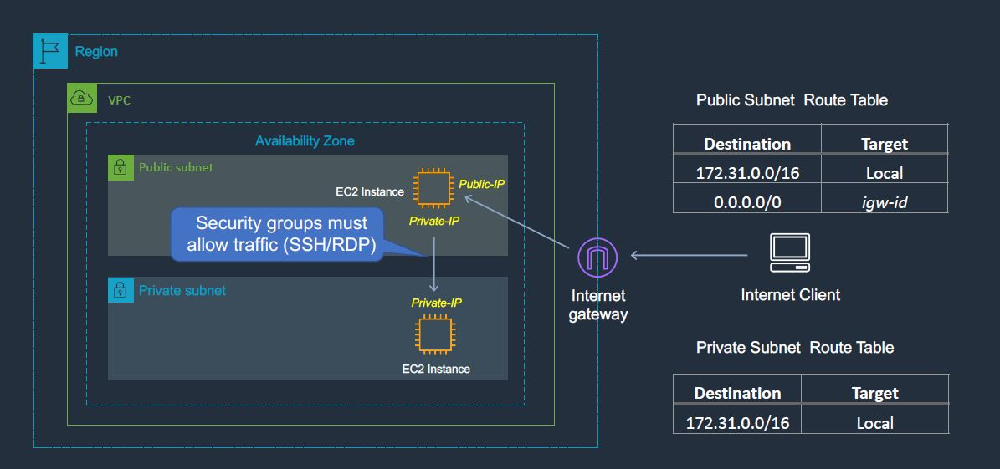
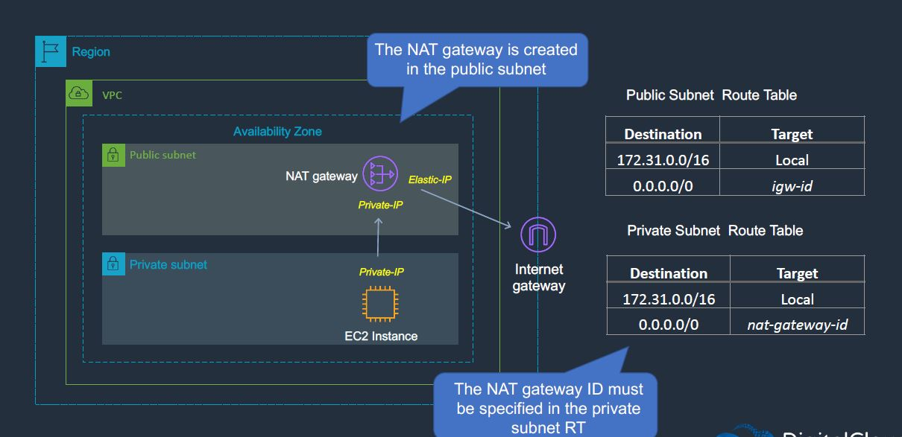

# How to Run 

## [Generate a key pair with name "mykey"](../generate-key-pair.md)

## [Set AWS Credentials](../provide-aws-cred-input.md) 

In this exmaple we are going to create below infrastructure.

1. Create a VPC
2. Create private and public subnet
3. Create EC2 instance in both the subnet. 
4. Treat EC2 instance in Public subnet as Bastin Host to connect with private subnet
5. Create Elastic IP Address.
6. Create NetGatway in public subnet. 
7. ssh into to Bastian Host. 
7. ssh into to private subnet Ec2 Instance from Bastian Host. 
9. Ping google.com to ensure private subnet Ec2 Instance can connect to Internet






## Then run the plan command to see what resources its going to create
```sh
    $ terraform plan

    An execution plan has been generated and is shown below.
    Resource actions are indicated with the following symbols:
    + create

    Terraform will perform the following actions:

    # aws_eip.application-eip will be created
    + resource "aws_eip" "application-eip" {
        + allocation_id        = (known after apply)
        + association_id       = (known after apply)
        + carrier_ip           = (known after apply)
        + customer_owned_ip    = (known after apply)
        + domain               = (known after apply)
        + id                   = (known after apply)
        + instance             = (known after apply)
        + network_border_group = (known after apply)
        + network_interface    = (known after apply)
        + private_dns          = (known after apply)
        + private_ip           = (known after apply)
        + public_dns           = (known after apply)
        + public_ip            = (known after apply)
        + public_ipv4_pool     = (known after apply)
        + tags                 = {
            + "AppName" = "application"
            + "Name"    = "application-eip"
            }
        + tags_all             = {
            + "AppName" = "application"
            + "Name"    = "application-eip"
            }
        + vpc                  = true
        }

    # aws_instance.application-back-end-server will be created
    + resource "aws_instance" "application-back-end-server" {
        + ami                                  = "ami-0915bcb5fa77e4892"
        + arn                                  = (known after apply)
        + associate_public_ip_address          = (known after apply)
        + availability_zone                    = (known after apply)
        + cpu_core_count                       = (known after apply)
        + cpu_threads_per_core                 = (known after apply)
        + get_password_data                    = false
        + host_id                              = (known after apply)
        + id                                   = (known after apply)
        + instance_initiated_shutdown_behavior = (known after apply)
        + instance_state                       = (known after apply)
        + instance_type                        = "t2.micro"
        + ipv6_address_count                   = (known after apply)
        + ipv6_addresses                       = (known after apply)
        + key_name                             = "mykeypair"
        + outpost_arn                          = (known after apply)
        + password_data                        = (known after apply)
        + placement_group                      = (known after apply)
        + primary_network_interface_id         = (known after apply)
        + private_dns                          = (known after apply)
        + private_ip                           = (known after apply)
        + public_dns                           = (known after apply)
        + public_ip                            = (known after apply)
        + secondary_private_ips                = (known after apply)
        + security_groups                      = (known after apply)
        + source_dest_check                    = true
        + subnet_id                            = (known after apply)
        + tags                                 = {
            + "AppName" = "application"
            + "Name"    = "application-back-end-server"
            }
        + tags_all                             = {
            + "AppName" = "application"
            + "Name"    = "application-back-end-server"
            }
        + tenancy                              = (known after apply)
        + vpc_security_group_ids               = (known after apply)

        + ebs_block_device {
            + delete_on_termination = (known after apply)
            + device_name           = (known after apply)
            + encrypted             = (known after apply)
            + iops                  = (known after apply)
            + kms_key_id            = (known after apply)
            + snapshot_id           = (known after apply)
            + tags                  = (known after apply)
            + throughput            = (known after apply)
            + volume_id             = (known after apply)
            + volume_size           = (known after apply)
            + volume_type           = (known after apply)
            }

        + enclave_options {
            + enabled = (known after apply)
            }

        + ephemeral_block_device {
            + device_name  = (known after apply)
            + no_device    = (known after apply)
            + virtual_name = (known after apply)
            }

        + metadata_options {
            + http_endpoint               = (known after apply)
            + http_put_response_hop_limit = (known after apply)
            + http_tokens                 = (known after apply)
            }

        + network_interface {
            + delete_on_termination = (known after apply)
            + device_index          = (known after apply)
            + network_interface_id  = (known after apply)
            }

        + root_block_device {
            + delete_on_termination = (known after apply)
            + device_name           = (known after apply)
            + encrypted             = (known after apply)
            + iops                  = (known after apply)
            + kms_key_id            = (known after apply)
            + tags                  = (known after apply)
            + throughput            = (known after apply)
            + volume_id             = (known after apply)
            + volume_size           = (known after apply)
            + volume_type           = (known after apply)
            }
        }

    # aws_instance.application-bastion-host will be created
    + resource "aws_instance" "application-bastion-host" {
        + ami                                  = "ami-0915bcb5fa77e4892"
        + arn                                  = (known after apply)
        + associate_public_ip_address          = (known after apply)
        + availability_zone                    = (known after apply)
        + cpu_core_count                       = (known after apply)
        + cpu_threads_per_core                 = (known after apply)
        + get_password_data                    = false
        + host_id                              = (known after apply)
        + id                                   = (known after apply)
        + instance_initiated_shutdown_behavior = (known after apply)
        + instance_state                       = (known after apply)
        + instance_type                        = "t2.micro"
        + ipv6_address_count                   = (known after apply)
        + ipv6_addresses                       = (known after apply)
        + key_name                             = "mykeypair"
        + outpost_arn                          = (known after apply)
        + password_data                        = (known after apply)
        + placement_group                      = (known after apply)
        + primary_network_interface_id         = (known after apply)
        + private_dns                          = (known after apply)
        + private_ip                           = (known after apply)
        + public_dns                           = (known after apply)
        + public_ip                            = (known after apply)
        + secondary_private_ips                = (known after apply)
        + security_groups                      = (known after apply)
        + source_dest_check                    = true
        + subnet_id                            = (known after apply)
        + tags                                 = {
            + "AppName" = "application"
            + "Name"    = "application-bastion-host"
            }
        + tags_all                             = {
            + "AppName" = "application"
            + "Name"    = "application-bastion-host"
            }
        + tenancy                              = (known after apply)
        + vpc_security_group_ids               = (known after apply)

        + ebs_block_device {
            + delete_on_termination = (known after apply)
            + device_name           = (known after apply)
            + encrypted             = (known after apply)
            + iops                  = (known after apply)
            + kms_key_id            = (known after apply)
            + snapshot_id           = (known after apply)
            + tags                  = (known after apply)
            + throughput            = (known after apply)
            + volume_id             = (known after apply)
            + volume_size           = (known after apply)
            + volume_type           = (known after apply)
            }

        + enclave_options {
            + enabled = (known after apply)
            }

        + ephemeral_block_device {
            + device_name  = (known after apply)
            + no_device    = (known after apply)
            + virtual_name = (known after apply)
            }

        + metadata_options {
            + http_endpoint               = (known after apply)
            + http_put_response_hop_limit = (known after apply)
            + http_tokens                 = (known after apply)
            }

        + network_interface {
            + delete_on_termination = (known after apply)
            + device_index          = (known after apply)
            + network_interface_id  = (known after apply)
            }

        + root_block_device {
            + delete_on_termination = (known after apply)
            + device_name           = (known after apply)
            + encrypted             = (known after apply)
            + iops                  = (known after apply)
            + kms_key_id            = (known after apply)
            + tags                  = (known after apply)
            + throughput            = (known after apply)
            + volume_id             = (known after apply)
            + volume_size           = (known after apply)
            + volume_type           = (known after apply)
            }
        }

    # aws_internet_gateway.sgsys-application-internate-gateway will be created
    + resource "aws_internet_gateway" "sgsys-application-internate-gateway" {
        + arn      = (known after apply)
        + id       = (known after apply)
        + owner_id = (known after apply)
        + tags     = {
            + "Name" = "sgsys-application-internate-gateway"
            }
        + tags_all = {
            + "Name" = "sgsys-application-internate-gateway"
            }
        + vpc_id   = (known after apply)
        }

    # aws_key_pair.application-keypair will be created
    + resource "aws_key_pair" "application-keypair" {
        + arn         = (known after apply)
        + fingerprint = (known after apply)
        + id          = (known after apply)
        + key_name    = "mykeypair"
        + key_pair_id = (known after apply)
        + public_key  = "....."
        + tags_all    = (known after apply)
        }

    # aws_nat_gateway.application-nat-gw will be created
    + resource "aws_nat_gateway" "application-nat-gw" {
        + allocation_id        = (known after apply)
        + id                   = (known after apply)
        + network_interface_id = (known after apply)
        + private_ip           = (known after apply)
        + public_ip            = (known after apply)
        + subnet_id            = (known after apply)
        + tags_all             = (known after apply)
        }

    # aws_route_table.application-private-route-table will be created
    + resource "aws_route_table" "application-private-route-table" {
        + arn              = (known after apply)
        + id               = (known after apply)
        + owner_id         = (known after apply)
        + propagating_vgws = (known after apply)
        + route            = [
            + {
                + carrier_gateway_id         = ""
                + cidr_block                 = "0.0.0.0/0"
                + destination_prefix_list_id = ""
                + egress_only_gateway_id     = ""
                + gateway_id                 = ""
                + instance_id                = ""
                + ipv6_cidr_block            = ""
                + local_gateway_id           = ""
                + nat_gateway_id             = (known after apply)
                + network_interface_id       = ""
                + transit_gateway_id         = ""
                + vpc_endpoint_id            = ""
                + vpc_peering_connection_id  = ""
                },
            ]
        + tags             = {
            + "AppName" = "application"
            + "Name"    = "application-pri-subnet-1"
            }
        + tags_all         = {
            + "AppName" = "application"
            + "Name"    = "application-pri-subnet-1"
            }
        + vpc_id           = (known after apply)
        }

    # aws_route_table.application-public-route-table will be created
    + resource "aws_route_table" "application-public-route-table" {
        + arn              = (known after apply)
        + id               = (known after apply)
        + owner_id         = (known after apply)
        + propagating_vgws = (known after apply)
        + route            = [
            + {
                + carrier_gateway_id         = ""
                + cidr_block                 = "0.0.0.0/0"
                + destination_prefix_list_id = ""
                + egress_only_gateway_id     = ""
                + gateway_id                 = (known after apply)
                + instance_id                = ""
                + ipv6_cidr_block            = ""
                + local_gateway_id           = ""
                + nat_gateway_id             = ""
                + network_interface_id       = ""
                + transit_gateway_id         = ""
                + vpc_endpoint_id            = ""
                + vpc_peering_connection_id  = ""
                },
            ]
        + tags             = {
            + "Name" = "application-pub-subnet-1"
            }
        + tags_all         = {
            + "Name" = "application-pub-subnet-1"
            }
        + vpc_id           = (known after apply)
        }

    # aws_route_table_association.application-rt-assoc-pri-subnet-1 will be created
    + resource "aws_route_table_association" "application-rt-assoc-pri-subnet-1" {
        + id             = (known after apply)
        + route_table_id = (known after apply)
        + subnet_id      = (known after apply)
        }

    # aws_route_table_association.application-rt-assoc-pub-subnet-1 will be created
    + resource "aws_route_table_association" "application-rt-assoc-pub-subnet-1" {
        + id             = (known after apply)
        + route_table_id = (known after apply)
        + subnet_id      = (known after apply)
        }

    # aws_security_group.allow-ssh will be created
    + resource "aws_security_group" "allow-ssh" {
        + arn                    = (known after apply)
        + description            = "security group that allows ssh and all egress traffic"
        + egress                 = [
            + {
                + cidr_blocks      = [
                    + "0.0.0.0/0",
                    ]
                + description      = ""
                + from_port        = 0
                + ipv6_cidr_blocks = []
                + prefix_list_ids  = []
                + protocol         = "-1"
                + security_groups  = []
                + self             = false
                + to_port          = 0
                },
            ]
        + id                     = (known after apply)
        + ingress                = [
            + {
                + cidr_blocks      = [
                    + "0.0.0.0/0",
                    ]
                + description      = ""
                + from_port        = 22
                + ipv6_cidr_blocks = []
                + prefix_list_ids  = []
                + protocol         = "tcp"
                + security_groups  = []
                + self             = false
                + to_port          = 22
                },
            ]
        + name                   = "allow-ssh"
        + name_prefix            = (known after apply)
        + owner_id               = (known after apply)
        + revoke_rules_on_delete = false
        + tags                   = {
            + "AppName" = "application"
            + "Name"    = "allow-ssh-security-group"
            }
        + tags_all               = {
            + "AppName" = "application"
            + "Name"    = "allow-ssh-security-group"
            }
        + vpc_id                 = (known after apply)
        }

    # aws_subnet.application-pri-subnet-us-east-1b will be created
    + resource "aws_subnet" "application-pri-subnet-us-east-1b" {
        + arn                             = (known after apply)
        + assign_ipv6_address_on_creation = false
        + availability_zone               = "us-east-1b"
        + availability_zone_id            = (known after apply)
        + cidr_block                      = "10.0.2.0/24"
        + id                              = (known after apply)
        + ipv6_cidr_block_association_id  = (known after apply)
        + map_public_ip_on_launch         = false
        + owner_id                        = (known after apply)
        + tags                            = {
            + "AppName" = "application"
            + "Name"    = "application-pri-subnet-us-east-1b"
            }
        + tags_all                        = {
            + "AppName" = "application"
            + "Name"    = "application-pri-subnet-us-east-1b"
            }
        + vpc_id                          = (known after apply)
        }

    # aws_subnet.application-pub-subnet-us-east-1a will be created
    + resource "aws_subnet" "application-pub-subnet-us-east-1a" {
        + arn                             = (known after apply)
        + assign_ipv6_address_on_creation = false
        + availability_zone               = "us-east-1a"
        + availability_zone_id            = (known after apply)
        + cidr_block                      = "10.0.1.0/24"
        + id                              = (known after apply)
        + ipv6_cidr_block_association_id  = (known after apply)
        + map_public_ip_on_launch         = true
        + owner_id                        = (known after apply)
        + tags                            = {
            + "AppName" = "application"
            + "Name"    = "application-pub-subnet-us-east-1a"
            }
        + tags_all                        = {
            + "AppName" = "application"
            + "Name"    = "application-pub-subnet-us-east-1a"
            }
        + vpc_id                          = (known after apply)
        }

    # aws_vpc.sgsys-application-vpc will be created
    + resource "aws_vpc" "sgsys-application-vpc" {
        + arn                              = (known after apply)
        + assign_generated_ipv6_cidr_block = false
        + cidr_block                       = "10.0.0.0/16"
        + default_network_acl_id           = (known after apply)
        + default_route_table_id           = (known after apply)
        + default_security_group_id        = (known after apply)
        + dhcp_options_id                  = (known after apply)
        + enable_classiclink               = false
        + enable_classiclink_dns_support   = (known after apply)
        + enable_dns_hostnames             = true
        + enable_dns_support               = true
        + id                               = (known after apply)
        + instance_tenancy                 = "default"
        + ipv6_association_id              = (known after apply)
        + ipv6_cidr_block                  = (known after apply)
        + main_route_table_id              = (known after apply)
        + owner_id                         = (known after apply)
        + tags                             = {
            + "AppName" = "application"
            + "Name"    = "sgsys-application-vpc"
            }
        + tags_all                         = {
            + "AppName" = "application"
            + "Name"    = "sgsys-application-vpc"
            }
        }

    Plan: 14 to add, 0 to change, 0 to destroy.

    Changes to Outputs:
    + application-bastion-host-private_ip = (known after apply)
    + application-bastion-host-public_ip  = (known after apply)

    ------------------------------------------------------------------------

    Note: You didn't specify an "-out" parameter to save this plan, so Terraform
    can't guarantee that exactly these actions will be performed if
    "terraform apply" is subsequently run.
```

## run the Apply command to create resources 
```sh
    $ terraform apply -auto-approve
    aws_key_pair.application-keypair: Refreshing state... [id=mykeypair]
    aws_vpc.sgsys-application-vpc: Refreshing state... [id=vpc-06a1bf7792e154e02]
    aws_eip.application-eip: Refreshing state... [id=eipalloc-0c82e7e4a15e7efb8]
    aws_subnet.application-pri-subnet-us-east-1b: Refreshing state... [id=subnet-0ab2c81da86193b77]   
    aws_internet_gateway.sgsys-application-internate-gateway: Refreshing state... [id=igw-01465a63152a4c0d3]
    aws_subnet.application-pub-subnet-us-east-1a: Refreshing state... [id=subnet-0b504616ed790d3b1]
    aws_security_group.allow-ssh: Refreshing state... [id=sg-049d3ea94fdc22034]
    aws_route_table.application-public-route-table: Refreshing state... [id=rtb-086674b66069dcf99]
    aws_instance.application-back-end-server: Refreshing state... [id=i-0cb2ca0352a48b808]
    aws_nat_gateway.application-nat-gw: Refreshing state... [id=nat-0c3e9eadc5c6ed4b8]    
    aws_instance.application-bastion-host: Refreshing state... [id=i-07782d9965c8c2364]
    aws_route_table_association.application-rt-assoc-pub-subnet-1: Refreshing state... [id=rtbassoc-0aeb5e0ce4d2a2482]
    aws_route_table.application-private-route-table: Refreshing state... [id=rtb-02e9dc19fb6637758]
    aws_route_table_association.application-rt-assoc-pri-subnet-1: Refreshing state... [id=rtbassoc-03f33718ad5905088]

    Apply complete! Resources: 0 added, 0 changed, 0 destroyed.

    Outputs:

    application-backend-server-private_ip = "10.0.2.215"
    application-bastion-host-public_ip = "3.219.33.227"

```


## Connect to Bastian Host and Private Ec2 Instance. 

```sh
    $ ssh -i mykey ec2-user@3.219.33.227

       __|  __|_  )
       _|  (     /   Amazon Linux 2 AMI
      ___|\___|___|

    https://aws.amazon.com/amazon-linux-2/
    8 package(s) needed for security, out of 21 available
    Run "sudo yum update" to apply all updates.
```

```sh

    [ec2-user@ip-10-0-1-68 ~]$ ssh -i mykey ec2-user@10.0.2.215
    The authenticity of host '10.0.2.215 (10.0.2.215)' can't be established.
    ECDSA key fingerprint is SHA256:fZvDVd7WdcxjkX8i88sNcRZ37n4YsMOioSu0esnO9gY.
    ECDSA key fingerprint is MD5:4f:3a:7a:d1:64:cc:de:cb:7f:72:cd:eb:6f:5f:ee:49.
    Are you sure you want to continue connecting (yes/no)? yes
    Warning: Permanently added '10.0.2.215' (ECDSA) to the list of known hosts.

        __|  __|_  )
        _|  (     /   Amazon Linux 2 AMI
        ___|\___|___|

    https://aws.amazon.com/amazon-linux-2/
    [ec2-user@ip-10-0-2-215 ~]$ ping google.com
    PING google.com (142.250.81.206) 56(84) bytes of data.
    64 bytes from iad30s43-in-f14.1e100.net (142.250.81.206): icmp_seq=1 ttl=51 time=1.90 ms
    64 bytes from iad30s43-in-f14.1e100.net (142.250.81.206): icmp_seq=2 ttl=51 time=1.44 ms
    64 bytes from iad30s43-in-f14.1e100.net (142.250.81.206): icmp_seq=3 ttl=51 time=1.43 ms
    ^C
    --- google.com ping statistics ---
    3 packets transmitted, 3 received, 0% packet loss, time 2003ms
    rtt min/avg/max/mdev = 1.437/1.596/1.904/0.217 ms
    [ec2-user@ip-10-0-2-215 ~]$ Connection to 3.219.33.227 closed by remote host.
    Connection to 3.219.33.227 closed.
```


