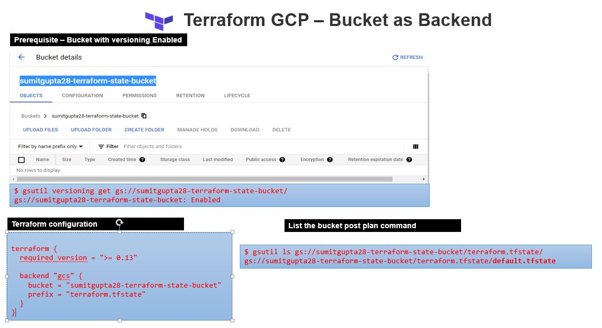

# Terraform on GCP (Google Cloud Platform)

## [Setup GCP Project and Service Account](../01-gcp-setup/README.md) 

## GCP bucket as backend for Terraform

### Prerequisite 

- A GCP bucket with versioning enable.


#### [Enable versioning](https://cloud.google.com/storage/docs/using-object-versioning#gsutil_1)

- versioning can be enable via cloudshell using gsutil command

**List the buckets**

```sh
    $ gsutil ls
    gs://sumitgupta28-terraform-state-bucket/
    
```

**Enable versioning buckets**

```sh
    $ gsutil versioning set on gs://sumitgupta28-terraform-state-bucket/
    Enabling versioning for gs://sumitgupta28-terraform-state-bucket/...
```

**Checking whether Object Versioning is enabled**

```sh
    $ gsutil versioning get gs://sumitgupta28-terraform-state-bucket/                 
    gs://sumitgupta28-terraform-state-bucket: Enabled
```


(Running Terraform on your workstation.)[https://www.terraform.io/docs/language/settings/backends/gcs.html#running-terraform-on-your-workstation-]
If you are using terraform on your workstation, you will need to install the Google Cloud SDK and authenticate using User Application Default Credentials.

User ADCs do expire and you can refresh them by running gcloud auth application-default login.


### terrfrom backend configuration 

```sh

    terraform {
    required_version = ">= 0.13"

    backend "gcs" {
        bucket  = "sumitgupta28-terraform-state-bucket"
        prefix  = "terraform.tfstate"
    }
    }


```


### terrfrom init backend  

```sh

    $ terraform init

    Initializing the backend...

    Successfully configured the backend "gcs"! Terraform will automatically
    use this backend unless the backend configuration changes.

    Initializing provider plugins...
    - Finding hashicorp/google versions matching "3.61.0"...
    - Installing hashicorp/google v3.61.0...
    - Installed hashicorp/google v3.61.0 (signed by HashiCorp)

    Terraform has created a lock file .terraform.lock.hcl to record the provider
    selections it made above. Include this file in your version control repository
    so that Terraform can guarantee to make the same selections by default when
    you run "terraform init" in the future.

    Terraform has been successfully initialized!

    You may now begin working with Terraform. Try running "terraform plan" to see
    any changes that are required for your infrastructure. All Terraform commands
    should now work.

    If you ever set or change modules or backend configuration for Terraform,
    rerun this command to reinitialize your working directory. If you forget, other
    commands will detect it and remind you to do so if necessary.

```


### terraform Plan

```sh
    $ terraform plan

    An execution plan has been generated and is shown below.
    Resource actions are indicated with the following symbols:
    + create

    Terraform will perform the following actions:

    # google_compute_instance.app-instance will be created
    + resource "google_compute_instance" "app-instance" {
        + can_ip_forward       = false
        + cpu_platform         = (known after apply)
        + current_status       = (known after apply)
        + deletion_protection  = false
        + guest_accelerator    = (known after apply)
        + id                   = (known after apply)
        + instance_id          = (known after apply)
        + label_fingerprint    = (known after apply)
        + machine_type         = "f1-micro"
        + metadata_fingerprint = (known after apply)
        + min_cpu_platform     = (known after apply)
        + name                 = "test-app-server"
        + project              = (known after apply)
        + self_link            = (known after apply)
        + tags_fingerprint     = (known after apply)
        + zone                 = "us-central1-a"

        + boot_disk {
            + auto_delete                = true
            + device_name                = (known after apply)
            + disk_encryption_key_sha256 = (known after apply)
            + kms_key_self_link          = (known after apply)
            + mode                       = "READ_WRITE"
            + source                     = (known after apply)

            + initialize_params {
                + image  = "debian-cloud/debian-9"
                + labels = (known after apply)
                + size   = (known after apply)
                + type   = (known after apply)
                }
            }

        + confidential_instance_config {
            + enable_confidential_compute = (known after apply)
            }

        + network_interface {
            + name               = (known after apply)
            + network            = "default"
            + network_ip         = (known after apply)
            + subnetwork         = (known after apply)
            + subnetwork_project = (known after apply)
            }

        + scheduling {
            + automatic_restart   = (known after apply)
            + min_node_cpus       = (known after apply)
            + on_host_maintenance = (known after apply)
            + preemptible         = (known after apply)

            + node_affinities {
                + key      = (known after apply)
                + operator = (known after apply)
                + values   = (known after apply)
                }
            }
        }

    # google_storage_bucket.test-bucket will be created
    + resource "google_storage_bucket" "test-bucket" {
        + bucket_policy_only          = (known after apply)
        + force_destroy               = false
        + id                          = (known after apply)
        + location                    = "US"
        + name                        = "sumitgupta28-testbucket-xxx"
        + project                     = (known after apply)
        + self_link                   = (known after apply)
        + storage_class               = "STANDARD"
        + uniform_bucket_level_access = (known after apply)
        + url                         = (known after apply)
        }

    Plan: 2 to add, 0 to change, 0 to destroy.

    ------------------------------------------------------------------------

    Note: You didn't specify an "-out" parameter to save this plan, so Terraform
    can't guarantee that exactly these actions will be performed if
    "terraform apply" is subsequently run.

```

### validate the state file

```sh

    $ gsutil ls gs://sumitgupta28-terraform-state-bucket/terraform.tfstate/
    gs://sumitgupta28-terraform-state-bucket/terraform.tfstate/default.tfstate

```

### clean up the bucket and content 

```sh

    $ gsutil rm -r gs://sumitgupta28-terraform-state-bucket/
    Removing gs://sumitgupta28-terraform-state-bucket/terraform.tfstate/default.tflock#1616771440579354...
    Removing gs://sumitgupta28-terraform-state-bucket/terraform.tfstate/default.tflock#1616771678434808...
    Removing gs://sumitgupta28-terraform-state-bucket/terraform.tfstate/default.tflock#1616771812288130...
    Removing gs://sumitgupta28-terraform-state-bucket/terraform.tfstate/default.tflock#1616771841491884...
    / [4 objects]
    ==> NOTE: You are performing a sequence of gsutil operations that may
    run significantly faster if you instead use gsutil -m rm ... Please
    see the -m section under "gsutil help options" for further information
    about when gsutil -m can be advantageous.
    Removing gs://sumitgupta28-terraform-state-bucket/terraform.tfstate/default.tfstate#1616771440785541...
    / [5 objects]
    Operation completed over 5 objects.
    Removing gs://sumitgupta28-terraform-state-bucket/...

```



