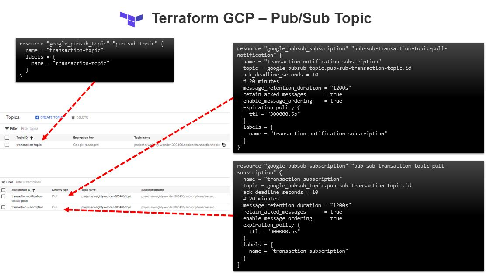

# Terraform on GCP (Google Cloud Platform)

## [Pub/Sub topic with Subscription](https://registry.terraform.io/providers/hashicorp/google/latest/docs/resources/pubsub_subscription)


### What is Google Cloud Pub/Sub?

- Google Cloud Pub/Sub is a managed, globally available messaging service that scales automatically with demand.
To understand the service in its most basic terms, familiarize yourself with four key components: topics, subscriptions, publisher clients, and subscriber clients.

    - Pub/Sub clients publish messages to topics.
    - Pub/Sub clients receive messages from subscriptions. 
    - You can create multiple subscriptions for the same topic, in which case each subscription gets a copy of all of the messages in the topic. 
    - Topics are for publishing only. 
    - The subscription is where you will receive all messages.
    - Your application can create multiple Pub/Sub clients to publish to a topic, across different processes. (With some caveats mentioned below.)
    - Your application can also create multiple subscriber clients for a single subscription, in which case message delivery is load balanced across all of them. Messages are delivered to one client on the subscription, not all of them.


## [Setup GCP Project and Service Account](../01-gcp-setup/README.md) 

## Topic Configuration 

```sh

    resource "google_pubsub_topic" "pub-sub-transaction-topic" {
    name = "transaction-topic"

    labels = {
        name = "transaction-topic"
    }
    }
```

## Subscription Configuration 

```sh
    resource "google_pubsub_subscription" "pub-sub-transaction-topic-pull-subscription" {
    name                 = "transaction-subscription"
    topic                = google_pubsub_topic.pub-sub-transaction-topic.id
    ack_deadline_seconds = 10
    # 20 minutes
    message_retention_duration = "1200s"
    retain_acked_messages      = true
    enable_message_ordering    = true
    expiration_policy {
        ttl = "300000.5s"
    }
    labels = {
        name = "transaction-subscription"
    }
    }
```

## Validate the Topic using gcloud

```sh

    $ gcloud pubsub topics list
    ---
    labels:
    name: transaction-topic
    name: projects/<<project_id>>/topics/transaction-topic
```


## Validate the subscriptions using gcloud
```sh

    $ gcloud pubsub subscriptions list
    ---
    ackDeadlineSeconds: 10
    enableMessageOrdering: true
    expirationPolicy:
    ttl: 300000.500s
    labels:
    name: transaction-notification-subscription
    messageRetentionDuration: 1200s
    name: projects/<<project_id>>/subscriptions/transaction-notification-subscription
    pushConfig: {}
    retainAckedMessages: true
    topic: projects/<<project_id>>/topics/transaction-topic
    ---
    ackDeadlineSeconds: 10
    enableMessageOrdering: true
    expirationPolicy:
    ttl: 300000.500s
    labels:
    name: transaction-subscription
    messageRetentionDuration: 1200s
    name: projects/<<project_id>>/subscriptions/transaction-subscription
    pushConfig: {}
    retainAckedMessages: true
    topic: projects/<<project_id>>/topics/transaction-topic

```


