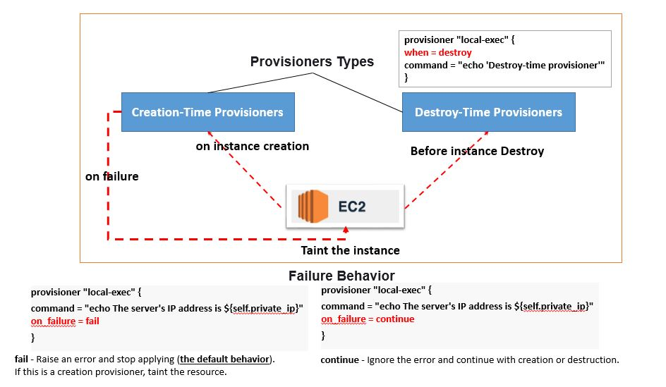

# Provisioners

Provisioners can be used to model specific actions on the local machine or on a remote machine in order to prepare servers or other infrastructure objects for service.


# How to Run 

Once you are in this directory. 

> Create a new file **terraform.tfvars** with below content 
```note
AWS_ACCESS_KEY = "<<YOUR_AWS_ACCESS_KEY>>"
AWS_SECRET_KEY = "<<YOUR_AWS_SECRET_KEY>>" 
```

Then run the plan command to see what resources its going to create


## Generate Key Pair

        $ ssh-keygen -f my-access-key
        Generating public/private rsa key pair.
        Enter passphrase (empty for no passphrase): 
        Enter same passphrase again: 
        Your identification has been saved in my-access-key.
        Your public key has been saved in my-access-key.pub.
        The key fingerprint is:
        SHA256:7JlA8t+tBn1yb2KDFeF0VoDoNuvoU/hW7YwX1NGgmBI Sumit@sumitgupta
        The key's randomart image is:
        +---[RSA 2048]----+
        |        E  . .o+o|
        |         ..o+.o..|
        |    . . ..oo.+ ..|
        |     + . .+ o . .|
        |      o S+ o +   |
        |       +o+=.= o  |
        |        =*.B.= . |
        |        o *.= *  |
        |       ..+.. =   |
        +----[SHA256]-----+


        $ ls -lrt
        total 2
        -rw-r--r-- 1 Sumit 197609 1675 Feb 24 10:29 my-access-key
        -rw-r--r-- 1 Sumit 197609  398 Feb 24 10:29 my-access-key.pub


```sh
$terraform plan
```

Run the Apply command to create resources 

```sh
$terraform apply -auto-approve
```

Once Complete 
- **local-exec** - 2 files will be created "private_ips.txt" & "public_ips.txt" containing the private and public  ip's 
- **remote-exec** 
    - Step 1 first login into server using the public ip and private key. 
    - Step 2 install nginx.


The following arguments are supported:

```sh

      provisioner "remote-exec" {
        inline = [
        "sudo amazon-linux-extras install -y nginx1.12",
        "sudo systemctl start nginx"
        ]

        connection {
        type        = "ssh"
        user        = "ec2-user"
        private_key = file(var.PATH_TO_PRIVATE_KEY)
        host        = self.public_ip
        }
    }
    
```

- **inline** - This is a list of command strings. They are executed in the order they are provided. This cannot be provided with script or scripts.

- **script** - This is a path (relative or absolute) to a local script that will be copied to the remote resource and then executed. This cannot be provided with inline or scripts.

- **scripts** - This is a list of paths (relative or absolute) to local scripts that will be copied to the remote resource and then executed. They are executed in the order they are provided. This cannot be provided with inline or script.

### [how to use scripts](https://www.terraform.io/docs/language/resources/provisioners/remote-exec.html#script-arguments)

You cannot pass any arguments to scripts using the script or scripts arguments to this provisioner. If you want to specify arguments, upload the script with the file provisioner and then use inline to call it. Example:

```sh

        resource "aws_instance" "web" {
        # ...

        provisioner "file" {
            source      = "script.sh"
            destination = "/tmp/script.sh"
        }

        provisioner "remote-exec" {
            inline = [
            "chmod +x /tmp/script.sh",
            "/tmp/script.sh args",
            ]
        }
        }
```


[Provisioners Without a Resource](https://www.terraform.io/docs/language/resources/provisioners/null_resource.html)

If you need to run provisioners that aren't directly associated with a specific resource, you can associate them with a **null_resource**.

Instances of **null_resource** are treated like normal resources, but they don't do anything. 
Like with any other resource, you can configure provisioners and connection details on a null_resource. 
You can also use its triggers argument and any meta-arguments to control exactly where in the dependency graph its provisioners will run.





### Creation-Time Provisioners

- By default, provisioners run when the resource they are defined within is created. 
- Creation-time provisioners are only run during creation, not during updating or any other lifecycle. 
- They are meant as a means to perform bootstrapping of a system. Hence no matter how many times you run creation-time (default) provisioners after creating a resourse it will not run.