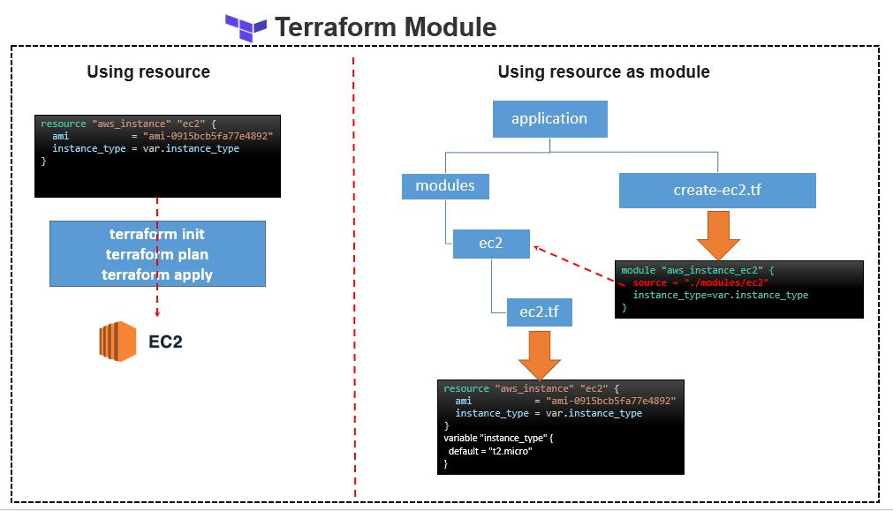
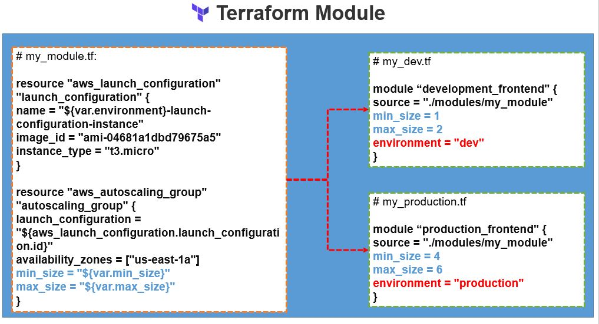

# Terraform Registry
The Terraform Registry includes a directory of ready-to-use modules for various common purposes, which can serve as larger building-blocks for our infrastructure.


# Terraform Module

Modules are used to create reusable components, improve organization, and to treat pieces of infrastructure as a black box.

So overall module allows to convert your infrastructure set into a parametrized package and that package can be re-used as module to create consistent infrastructure. 

This packages or module can be publish over [Terraform Registry](#Terraform-Registry) so it can be re-used by the community. 




# How to Run 

Once you are in this directory. 

> Create a new file **terraform.tfvars** with below content 
```note
AWS_ACCESS_KEY = "<<YOUR_AWS_ACCESS_KEY>>"
AWS_SECRET_KEY = "<<YOUR_AWS_SECRET_KEY>>" 
```

as we can see [create-ec2.tf](create-ec2.tf) having a modile name **aws_instance_ec2** which is module present in the  **source** location.

```sh

    module "aws_instance_ec2" {
    source = "./modules/ec2"
    instance_type=var.instance_type
    }

```

Then run the plan command to see what resources its going to create

```sh
$terrafrom plan
```

run the Apply command to create resources 

```sh
$terrafrom apply -auto-approve
```




## Module Source 

### Local Path - Must start with ./ or ../

```
    source = "./modules/ec2"
or
    source = "../modules/ec2"
```


### Git url - by default it pulles from default branch

```
    source = "git::https://github.com/ec2.git"
or
    source = "git::ssh://github.com/ec2.git"
or
    source = "git::ssh://github.com/ec2.git?ref=V1.2.0"
    source = "git::https://github.com/ec2.git?ref=V1.2.0"

or
    source = "github.com/ec2.git?ref=V1.2.0"

or
    source = "git@github.com/ec2.git?ref=V1.2.0"

```
