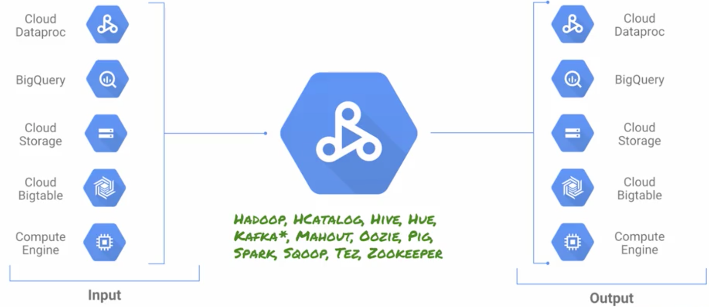
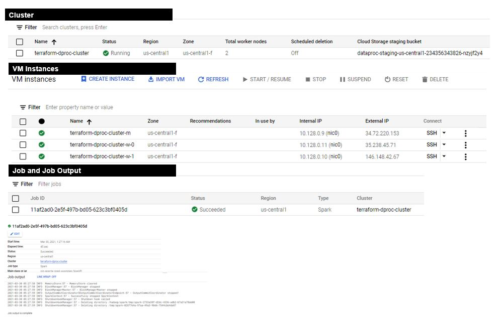

# Terraform on GCP (Google Cloud Platform)

### What is Cloud Dataproc?

Cloud Dataproc is a managed Spark and Hadoop service that lets you take advantage of open source data tools for batch processing, querying, streaming, and machine learning.

It disaggregates storage & compute. Say an external application is sending logs that you want to analyze, you store them in a data source. From Cloud Storage(GCS) the data is used by Dataproc for processing which then stores it back into GCS, BigQuery or Bigtable.

**Features:**

- With your existing MapReduce, you can operate on an immense amount of data each day without any overhead worries.
- With the in-built monitoring system, you can transfer your cluster data to your applications. You can get quick-reports from the system and also have the feature of storing data in Google’s BigQuery.
- Quick launch and delete smaller clusters stored in blob storage, as and when required using Spark (Spark SQL, PySpark, Spark shell).
- Spark Machine Learning Libraries and Data Science to customize and run classification algorithms.



## [Setup GCP Project and Service Account](../01-gcp-setup/README.md) 

## Create a Dataproc cluster

This will crete a master and worker config with default values having 1 master and 2 worker config  

```sh
    # Create a dataproc cluster
    resource "google_dataproc_cluster" "mycluster" {
    name   = "terraform-dproc-cluster"
    region = "us-central1"
    cluster_config {

            master_config {
            num_instances = 1
            machine_type  = "n1-standard-2"
            }

            worker_config {
            num_instances = 2
            machine_type  = "n1-standard-2"
            }
    }
    }

```


## Job to a dataproc cluster

```sh
    # Submit an example spark job to a dataproc cluster
    resource "google_dataproc_job" "spark" {
    region       = google_dataproc_cluster.mycluster.region
    force_delete = true
    placement {
        cluster_name = google_dataproc_cluster.mycluster.name
    }

    spark_config {
        main_class    = "org.apache.spark.examples.SparkPi"
        jar_file_uris = ["file:///usr/lib/spark/examples/jars/spark-examples.jar"]
        args          = ["1000"]

        properties = {
        "spark.logConf" = "true"
        }

        logging_config {
        driver_log_levels = {
            "root" = "INFO"
        }
        }
    }
    }
```

### lets apply this. 


```sh

    $ terraform apply -auto-approve
    google_dataproc_cluster.mycluster: Creating...
    google_dataproc_cluster.mycluster: Still creating... [10s elapsed]
    google_dataproc_cluster.mycluster: Still creating... [20s elapsed]
    google_dataproc_cluster.mycluster: Still creating... [30s elapsed]
    google_dataproc_cluster.mycluster: Still creating... [40s elapsed]
    google_dataproc_cluster.mycluster: Still creating... [50s elapsed]
    google_dataproc_cluster.mycluster: Still creating... [1m0s elapsed]
    google_dataproc_cluster.mycluster: Still creating... [1m10s elapsed]
    google_dataproc_cluster.mycluster: Still creating... [1m20s elapsed]
    google_dataproc_cluster.mycluster: Still creating... [1m30s elapsed]
    google_dataproc_cluster.mycluster: Still creating... [1m40s elapsed]
    google_dataproc_cluster.mycluster: Still creating... [1m50s elapsed]
    google_dataproc_cluster.mycluster: Still creating... [2m0s elapsed]
    google_dataproc_cluster.mycluster: Creation complete after 2m9s [id=projects/weighty-wonder-308406/regions/us-central1/clusters/terraform-dproc-cluster]  
    google_dataproc_job.spark: Creating...
    google_dataproc_job.spark: Creation complete after 1s [id=projects/weighty-wonder-308406/regions/us-central1/jobs/11af2ad0-2e5f-497b-bd05-623c3bf0405d]   
```

### Now validate on console




### Now validate via Command line 

1. list the cluster

```sh
    $ gcloud dataproc clusters list --region=us-central1
    NAME                     PLATFORM  WORKER_COUNT  PREEMPTIBLE_WORKER_COUNT  STATUS   ZONE           SCHEDULED_DELETE
    terraform-dproc-cluster  GCE       2                                       RUNNING  us-central1-f
```

2. list the jobs

```sh
    $ gcloud dataproc jobs list --region=us-central1
    JOB_ID                                TYPE   STATUS
    11af2ad0-2e5f-497b-bd05-623c3bf0405d  spark  DONE
```

3. list the VM Instances

```sh
    $ gcloud compute instances list
    NAME                         ZONE           MACHINE_TYPE   PREEMPTIBLE  INTERNAL_IP  EXTERNAL_IP    STATUS
    terraform-dproc-cluster-m    us-central1-f  n1-standard-2               10.128.0.9   34.72.220.153  RUNNING
    terraform-dproc-cluster-w-0  us-central1-f  n1-standard-2               10.128.0.11  35.238.45.71   RUNNING
    terraform-dproc-cluster-w-1  us-central1-f  n1-standard-2               10.128.0.10  146.148.42.67  RUNNING
```

3. delete the cluster

```sh
    $ gcloud dataproc clusters delete terraform-dproc-cluster --region=us-central1
    The cluster 'terraform-dproc-cluster' and all attached disks will be
    deleted.
    Do you want to continue (Y/n)?  y
    Waiting on operation [projects/weighty-wonder-308406/regions/us-central1/operations/83a065fd-b48a-3dc1-b897-5306979f10f7].
    Waiting for cluster deletion operation...done.
    Deleted [https://dataproc.googleapis.com/v1/projects/weighty-wonder-308406/regions/us-central1/clusters/terraform-dproc-cluster].
```

3. delete the Job

```sh
    $ gcloud dataproc jobs delete  11af2ad0-2e5f-497b-bd05-623c3bf0405d --region=us-central1
    The job '11af2ad0-2e5f-497b-bd05-623c3bf0405d' will be deleted.
    Do you want to continue (Y/n)?  y
    Waiting for job deletion...done.
    Deleted [https://dataproc.googleapis.com/v1/projects/weighty-wonder-308406/regions/us-central1/jobs/11af2ad0-2e5f-497b-bd05-623c3bf0405d].
```

4. Again List instance to ensure its delete.

```sh
    $ gcloud compute instances list
    Listed 0 items.
```