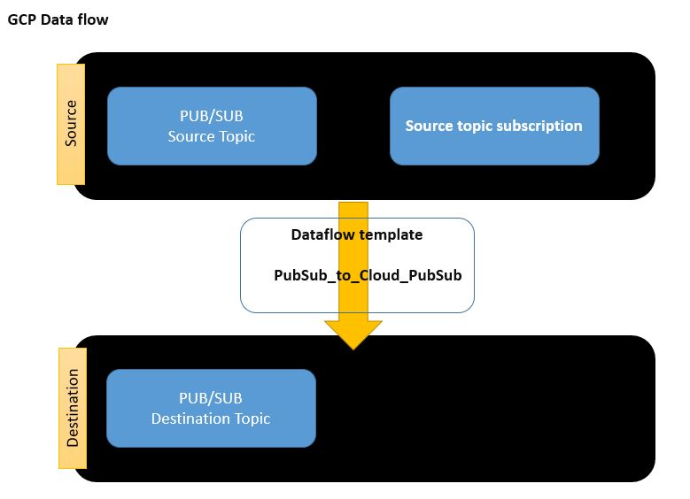

# Terraform on GCP (Google Cloud Platform)

### What is Cloud Dataflow?

The primary data processing techniques like the ETL are left-out when optimizing your data. According to Google, Dataflow can manage and operate batch and stream processing of data.

The main objective of Dataflow is to simplify Big Data. The programming and execution frameworks are merged to achieve parallelization. No cluster data is kept idle in Dataflow. Instead, the cluster is continuously monitored and remodeled (according to the algorithm in use).

Dataflow allows Apache Beam tasks with all the in-built functionality. Also, to run on Google Cloud Platform, which can be sluggish for any other tool.

**Features:**

1. ETL(Extract, transform, and load) data into multiple data warehouses at the same time.
2. Dataflow is considered as MapReduce replacement to handle large number of parallelization tasks.
3. It can scan real-time, user, management, financial, or retail sales data.
4. Processes immense amounts of data for research and predictions with data science techniques. Such as genomics, weather, and financial data.

### [List of Google Provided Templates](https://cloud.google.com/dataflow/docs/guides/templates/provided-templates)

```sh

    $ gsutil ls gs://dataflow-templates-us-central1/latest
    gs://dataflow-templates-us-central1/latest/Bulk_Compress_GCS_Files
    gs://dataflow-templates-us-central1/latest/Bulk_Compress_GCS_Files_metadata
    gs://dataflow-templates-us-central1/latest/Bulk_Decompress_GCS_Files
    gs://dataflow-templates-us-central1/latest/Bulk_Decompress_GCS_Files_metadata
    gs://dataflow-templates-us-central1/latest/Cassandra_To_Cloud_Bigtable
    gs://dataflow-templates-us-central1/latest/Cassandra_To_Cloud_Bigtable_metadata
    gs://dataflow-templates-us-central1/latest/Cloud_BigQuery_to_GCS_TensorFlow_Records
    gs://dataflow-templates-us-central1/latest/Cloud_BigQuery_to_GCS_TensorFlow_Records_metadata
    gs://dataflow-templates-us-central1/latest/Cloud_Bigtable_to_GCS_Avro
    gs://dataflow-templates-us-central1/latest/Cloud_Bigtable_to_GCS_Avro_metadata
    gs://dataflow-templates-us-central1/latest/Cloud_Bigtable_to_GCS_Parquet
    gs://dataflow-templates-us-central1/latest/Cloud_Bigtable_to_GCS_Parquet_metadata
    gs://dataflow-templates-us-central1/latest/Cloud_Bigtable_to_GCS_SequenceFile
    gs://dataflow-templates-us-central1/latest/Cloud_Bigtable_to_GCS_SequenceFile_metadata
    gs://dataflow-templates-us-central1/latest/Cloud_PubSub_to_Avro
    gs://dataflow-templates-us-central1/latest/Cloud_PubSub_to_Avro_metadata
    gs://dataflow-templates-us-central1/latest/Cloud_PubSub_to_Cloud_PubSub
    gs://dataflow-templates-us-central1/latest/Cloud_PubSub_to_Cloud_PubSub_metadata
    gs://dataflow-templates-us-central1/latest/Cloud_PubSub_to_GCS_Text
    gs://dataflow-templates-us-central1/latest/Cloud_PubSub_to_GCS_Text_metadata
    gs://dataflow-templates-us-central1/latest/Cloud_PubSub_to_Splunk
    gs://dataflow-templates-us-central1/latest/Cloud_PubSub_to_Splunk_metadata
    gs://dataflow-templates-us-central1/latest/Cloud_Spanner_to_GCS_Avro
    gs://dataflow-templates-us-central1/latest/Cloud_Spanner_to_GCS_Avro_metadata
    gs://dataflow-templates-us-central1/latest/Datastore_to_Datastore_Delete
    gs://dataflow-templates-us-central1/latest/Datastore_to_Datastore_Delete_metadata
    gs://dataflow-templates-us-central1/latest/Datastore_to_GCS_Text
    gs://dataflow-templates-us-central1/latest/Datastore_to_GCS_Text_metadata
    gs://dataflow-templates-us-central1/latest/GCS_Avro_to_Cloud_Bigtable
    gs://dataflow-templates-us-central1/latest/GCS_Avro_to_Cloud_Bigtable_metadata
    gs://dataflow-templates-us-central1/latest/GCS_Avro_to_Cloud_Spanner
    gs://dataflow-templates-us-central1/latest/GCS_Avro_to_Cloud_Spanner_metadata
    gs://dataflow-templates-us-central1/latest/GCS_Parquet_to_Cloud_Bigtable
    gs://dataflow-templates-us-central1/latest/GCS_Parquet_to_Cloud_Bigtable_metadata
    gs://dataflow-templates-us-central1/latest/GCS_SequenceFile_to_Cloud_Bigtable
    gs://dataflow-templates-us-central1/latest/GCS_SequenceFile_to_Cloud_Bigtable_metadata
    gs://dataflow-templates-us-central1/latest/GCS_Text_to_BigQuery
    gs://dataflow-templates-us-central1/latest/GCS_Text_to_BigQuery_metadata
    gs://dataflow-templates-us-central1/latest/GCS_Text_to_Cloud_PubSub
    gs://dataflow-templates-us-central1/latest/GCS_Text_to_Cloud_PubSub_metadata
    gs://dataflow-templates-us-central1/latest/GCS_Text_to_Cloud_Spanner
    gs://dataflow-templates-us-central1/latest/GCS_Text_to_Cloud_Spanner_metadata
    gs://dataflow-templates-us-central1/latest/GCS_Text_to_Datastore
    gs://dataflow-templates-us-central1/latest/GCS_Text_to_Datastore_metadata
    gs://dataflow-templates-us-central1/latest/Jdbc_to_BigQuery
    gs://dataflow-templates-us-central1/latest/Jdbc_to_BigQuery_metadata
    gs://dataflow-templates-us-central1/latest/PubSub_Subscription_to_BigQuery
    gs://dataflow-templates-us-central1/latest/PubSub_Subscription_to_BigQuery_metadata
    gs://dataflow-templates-us-central1/latest/PubSub_to_BigQuery
    gs://dataflow-templates-us-central1/latest/PubSub_to_BigQuery_metadata
    gs://dataflow-templates-us-central1/latest/Spanner_to_GCS_Text
    gs://dataflow-templates-us-central1/latest/Spanner_to_GCS_Text_metadata
    gs://dataflow-templates-us-central1/latest/Stream_DLP_GCS_Text_to_BigQuery
    gs://dataflow-templates-us-central1/latest/Stream_DLP_GCS_Text_to_BigQuery_metadata
    gs://dataflow-templates-us-central1/latest/Stream_GCS_Text_to_BigQuery
    gs://dataflow-templates-us-central1/latest/Stream_GCS_Text_to_BigQuery_metadata
    gs://dataflow-templates-us-central1/latest/Stream_GCS_Text_to_Cloud_PubSub
    gs://dataflow-templates-us-central1/latest/Stream_GCS_Text_to_Cloud_PubSub_metadata
    gs://dataflow-templates-us-central1/latest/Word_Count
    gs://dataflow-templates-us-central1/latest/Word_Count_metadata
    gs://dataflow-templates-us-central1/latest/flex/
    gs://dataflow-templates-us-central1/latest/ui_metadata/


```

Can be found at gs://dataflow-templates/latest/ as well

[Example Dataflow](https://cloud.google.com/dataflow/docs/guides/templates/provided-streaming#gcloud_3)


let Terraform this ...  

### Create Source and Destination topics

```sh
    ### Source Topic
    resource "google_pubsub_topic" "topic-dataflow-job-source" {
    name = "dataflow-job-source-topic"
    }
    ### Source Subscription
    resource "google_pubsub_subscription" "dataflow-job-source-topic-subscription" {
    name       = "dataflow-job-source-topic-subscription"
    topic      = google_pubsub_topic.topic-dataflow-job-source.name
    ack_deadline_seconds = 500
    depends_on = [google_pubsub_topic.topic-dataflow-job-source]
    }

    ### Destination Topic
    resource "google_pubsub_topic" "topic-dataflow-job-destination" {
    name = "dataflow-job-destination-topic"
    }

    ### Destination Subscription
    resource "google_pubsub_subscription" "dataflow-job-destination-topic-subscription" {
    name       = "dataflow-job-destination-topic-subscription"
    topic      = google_pubsub_topic.topic-dataflow-job-destination.name
    ack_deadline_seconds = 500
    depends_on = [google_pubsub_topic.topic-dataflow-job-destination]
    }
```

### Create Temp Processing bucket

```sh
    ### Temp Bucket
    resource "google_storage_bucket" "temp-working-bucket" {
    name                        = "sumitgupta28-temp-working-bucket"
    location                    = "US"
    force_destroy               = true
    uniform_bucket_level_access = true
    storage_class               = "STANDARD"
    }
    ### Temp Bucket with temp folder
    resource "google_storage_bucket_object" "temp-working-bucket-folder" {
    name    = "temp/"
    content = "Not really a directory, but it's empty."
    bucket  = google_storage_bucket.temp-working-bucket.name
    }
```

### Create Dataflow with Cloud_PubSub_to_Cloud_PubSub template

```sh
    ## dataflow job
    resource "google_dataflow_job" "pubsub-pubsub-stream" {
    name              = "pubsub-pubsub-stream-1"
    template_gcs_path = "gs://dataflow-templates-us-central1/latest/Cloud_PubSub_to_Cloud_PubSub"
    temp_gcs_location = var.TEMP_BUCKET_NAME
    region            = var.GCP_REGION
    parameters = {
        "inputSubscription"  = google_pubsub_subscription.dataflow-job-source-topic-subscription.path
        "outputTopic" = google_pubsub_topic.topic-dataflow-job-destination.id
    }
    depends_on = [
        google_pubsub_topic.topic-dataflow-job-source,
        google_pubsub_subscription.dataflow-job-source-topic-subscription,
        google_pubsub_topic.topic-dataflow-job-destination,
    ]
    labels = {
        "name" = "pubsub-pubsub-stream"
    }
    
    machine_type = "n1-standard-2"
    max_workers  = 1
    on_delete    = "cancel"
    }
```


### Apply 
```sh
    $ terraform apply -auto-approve
    google_pubsub_topic.topic-dataflow-job-destination: Refreshing state... [id=projects/weighty-wonder-308406/topics/dataflow-job-destination-topic]
    google_pubsub_topic.topic-dataflow-job-source: Refreshing state... [id=projects/weighty-wonder-308406/topics/dataflow-job-source-topic]
    google_storage_bucket.temp-working-bucket: Refreshing state... [id=sumitgupta28-temp-working-bucket]
    google_pubsub_subscription.dataflow-job-source-topic-subscription: Refreshing state... [id=projects/weighty-wonder-308406/subscriptions/dataflow-job-source-topic-subscription]
    google_storage_bucket_object.temp-working-bucket-folder: Refreshing state... [id=sumitgupta28-temp-working-bucket-temp/]
    google_dataflow_job.pubsub-pubsub-stream: Refreshing state... [id=2021-04-01_21_00_59-15821056879312934045]
    google_pubsub_subscription.dataflow-job-destination-topic-subscription: Creating...
    google_pubsub_subscription.dataflow-job-destination-topic-subscription: Creation complete after 4s [id=projects/weighty-wonder-308406/subscriptions/dataflow-job-destination-topic-subscription]

    Apply complete! Resources: 1 added, 0 changed, 0 destroyed.

    Outputs:

    dataflow-job-source-topic-subscription-path = "projects/weighty-wonder-308406/subscriptions/dataflow-job-source-topic-subscription"
    google_pubsub_topic-topic-dataflow-job-destination-id = "projects/weighty-wonder-308406/topics/dataflow-job-destination-topic"

```


### Validation 

#### Push Message to Source Topic

```sh

    $ gcloud pubsub topics publish dataflow-job-source-topic --message="{"name":"Sumi1t"}"    
    messageIds:
    - '2139197113918280'

```

#### Validate Message received by Destination Subscription

```sh

$ gcloud pubsub subscriptions pull dataflow-job-destination-topic-subscription --auto-ack
┌───────────────┬──────────────────┬──────────────┬────────────┬──────────────────┐
│      DATA     │    MESSAGE_ID    │ ORDERING_KEY │ ATTRIBUTES │ DELIVERY_ATTEMPT │
├───────────────┼──────────────────┼──────────────┼────────────┼──────────────────┤
│ {name:Sumi1t} │ 2226623605636027 │              │            │                  │
└───────────────┴──────────────────┴──────────────┴────────────┴──────────────────┘

```




### Finally Cleanup 

```sh
    $ terraform destroy -auto-approve
    google_storage_bucket_object.temp-working-bucket-folder: Destroying... [id=sumitgupta28-temp-working-bucket-temp/]
    google_pubsub_subscription.dataflow-job-destination-topic-subscription: Destroying... [id=projects/weighty-wonder-308406/subscriptions/dataflow-job-destination-topic-subscription]
    google_dataflow_job.pubsub-pubsub-stream: Destroying... [id=2021-04-01_21_00_59-15821056879312934045]
    google_storage_bucket_object.temp-working-bucket-folder: Destruction complete after 1s
    google_storage_bucket.temp-working-bucket: Destroying... [id=sumitgupta28-temp-working-bucket]
    google_pubsub_subscription.dataflow-job-destination-topic-subscription: Destruction complete after 2s
    google_storage_bucket.temp-working-bucket: Destruction complete after 2s
    google_dataflow_job.pubsub-pubsub-stream: Still destroying... [id=2021-04-01_21_00_59-15821056879312934045, 10s elapsed]
    google_dataflow_job.pubsub-pubsub-stream: Still destroying... [id=2021-04-01_21_00_59-15821056879312934045, 20s elapsed]
    google_dataflow_job.pubsub-pubsub-stream: Still destroying... [id=2021-04-01_21_00_59-15821056879312934045, 30s elapsed]
    google_dataflow_job.pubsub-pubsub-stream: Still destroying... [id=2021-04-01_21_00_59-15821056879312934045, 40s elapsed]
    google_dataflow_job.pubsub-pubsub-stream: Still destroying... [id=2021-04-01_21_00_59-15821056879312934045, 50s elapsed]
    google_dataflow_job.pubsub-pubsub-stream: Still destroying... [id=2021-04-01_21_00_59-15821056879312934045, 1m1s elapsed]
    google_dataflow_job.pubsub-pubsub-stream: Destruction complete after 1m8s
    google_pubsub_topic.topic-dataflow-job-destination: Destroying... [id=projects/weighty-wonder-308406/topics/dataflow-job-destination-topic]
    google_pubsub_subscription.dataflow-job-source-topic-subscription: Destroying... [id=projects/weighty-wonder-308406/subscriptions/dataflow-job-source-topic-subscription]
    google_pubsub_topic.topic-dataflow-job-destination: Destruction complete after 1s
    google_pubsub_subscription.dataflow-job-source-topic-subscription: Destruction complete after 1s
    google_pubsub_topic.topic-dataflow-job-source: Destroying... [id=projects/weighty-wonder-308406/topics/dataflow-job-source-topic]
    google_pubsub_topic.topic-dataflow-job-source: Destruction complete after 1s

    Destroy complete! Resources: 7 destroyed.

```