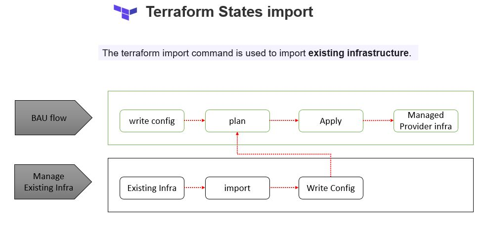

# [State Import](https://www.terraform.io/docs/cli/import/usage.html)

The terraform import command is used to import existing infrastructure. The command currently can only import one resource at a time




So Let create an EC2 instance

1. Create a key pair and make sure you upload this pub key in AWS key pair or use your own Key Pair

```
    $ ssh-keygen -f manual-ec2-keypair
    Generating public/private rsa key pair.
    Enter passphrase (empty for no passphrase): 
    Enter same passphrase again: 
    Your identification has been saved in manual-ec2-keypair.
    Your public key has been saved in manual-ec2-keypair.pub.
    The key fingerprint is:
    SHA256:JV0wt7NbW/F4QEzDsHoSsd+fPKaWyFYbWvgnyYJX4e8 Sumit@sumitgupta
    The key's randomart image is:
    +---[RSA 2048]----+
    |          +.+=+  |
    |         . * +o. |
    |        . = + .. |
    |         o + = oo|
    |        S o * = +|
    |           + O.=.|
    |          o X B=.|
    |         . B Ooo.|
    |          o o.+E |
    +----[SHA256]-----+

```

2. create a basic ec2 instance via cli

```
    $ aws ec2 describe-subnets | grep SubnetId
                "SubnetId": "subnet-caba2595",
                "SubnetId": "subnet-8952f4b8",
                "SubnetId": "subnet-5153075f",
                "SubnetId": "subnet-926af3b3",
                "SubnetId": "subnet-a6ff6dc0",
                "SubnetId": "subnet-471a380a",

    $ aws ec2 run-instances --image-id ami-038f1ca1bd58a5790 --count 1 --instance-type t2.micro --key-name manual-ec2-keypair --subnet-id subnet-471a380a
    {
        "Groups": [],
        "Instances": [
            {
                "AmiLaunchIndex": 0,
                "ImageId": "ami-038f1ca1bd58a5790",
                "InstanceId": "i-0bda2484785afe33a",
                "InstanceType": "t2.micro",
                "KeyName": "manual-ec2-keypair",
    ... TRUNCATED ............
                "SubnetId": "subnet-471a380a",
                "VpcId": "vpc-bf1ab5c2",
    ... TRUNCATED ............}
```

Now EC2 instance is up and running so let try to import this one. 

create a tf file [instance.tf]
```sh
    resource "aws_instance" "front-end-server" {
    }
```

Now run import command

```sh
    $ terraform import aws_instance.ec2-server i-0bda2484785afe33a
    aws_instance.ec2-server: Importing from ID "i-0bda2484785afe33a"...
    aws_instance.ec2-server: Import prepared!
    Prepared aws_instance for import
    aws_instance.ec2-server: Refreshing state... [id=i-0bda2484785afe33a]

    Import successful!

    The resources that were imported are shown above. These resources are now in
    your Terraform state and will henceforth be managed by Terraform.
```

Since we havn;t configured any remote backend thats' you will see a **terraform.tfstate** containing state of already running ec2 instance as **aws_instance.ec2-server**


```
    $ terraform state list
    aws_instance.ec2-server
```

Now inorder to make any changes and maintain ec2 via terraform update the  **instance.tf** with values from **terraform.tfstate**. for example let add a tag

```sh 
    resource "aws_instance" "ec2-server" {
    ami= "ami-038f1ca1bd58a5790"
    instance_type= "t2.micro"
    tags = {
        Name ="ec2-server"
    }
    }
```

And now lets run the plan

```sh
    $ terraform plan
    aws_instance.ec2-server: Refreshing state... [id=i-0bda2484785afe33a]

    An execution plan has been generated and is shown below.  
    Resource actions are indicated with the following symbols:
    ~ update in-place

    Terraform will perform the following actions:

    # aws_instance.ec2-server will be updated in-place
    ~ resource "aws_instance" "ec2-server" {
            id                           = "i-0bda2484785afe33a"
        ~ tags                         = {
            + "Name" = "ec2-server"
            }
            # (27 unchanged attributes hidden)
            # (5 unchanged blocks hidden)
        }

    Plan: 0 to add, 1 to change, 0 to destroy.

    Changes to Outputs:
    + front-end-arn       = "arn:aws:ec2:us-east-1:119956859268:instance/i-0bda2484785afe33a"
    + front-end-public_ip = "54.235.21.237"

    ------------------------------------------------------------------------

    Note: You didn't specify an "-out" parameter to save this plan, so Terraform
    can't guarantee that exactly these actions will be performed if
    "terraform apply" is subsequently run.
```

As you can see its making in-place update for tags.