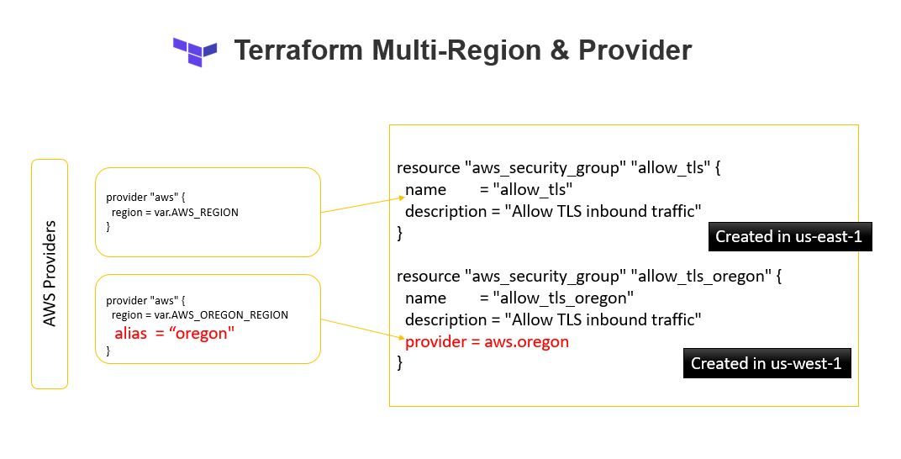

In this demo we will see how to use multiple aws provider seperated by the regions.  




this is how provider configuration looks like 

```sh
    provider "aws" {
    region = us-east-1
    }

    provider "aws" {
    region = us-west-2
    alias  = "oregon"
    }
```

Now we would like to create 2 security groups 
1. Security Group 1 [allow_tls] in us-east-1
2. Security Group 2 [allow_tls_oregon] in us-west-2 with **provider = aws.oregon**

```terraform

    resource "aws_security_group" "allow_tls" {
    name        = "allow_tls"
    description = "Allow TLS inbound traffic"
    ingress {
        description = "TLS from VPC"
        from_port   = 443
        to_port     = 443
        protocol    = "tcp"
        cidr_blocks = ["0.0.0.0/0"]
    }

    tags = {
        Name = "allow_tls"
    }
    }

    resource "aws_security_group" "allow_tls_oregon" {
    name        = "allow_tls_oregon"
    description = "Allow TLS inbound traffic"

    provider = aws.oregon

    ingress {
        description = "TLS from VPC"
        from_port   = 443
        to_port     = 443
        protocol    = "tcp"
        cidr_blocks = ["0.0.0.0/0"]
    }

    tags = {
        Name = "allow_tls_oregon"
    }
    }
```

now lets apply this and validate if we have 2 security group created in 2 differnt region.

**terraform plan**

```sh

    $ terraform plan

    An execution plan has been generated and is shown below.
    Resource actions are indicated with the following symbols:
    + create

    Terraform will perform the following actions:

    # aws_security_group.allow_tls will be created
    + resource "aws_security_group" "allow_tls" {
        + arn                    = (known after apply)
        + description            = "Allow TLS inbound traffic"
        + egress                 = (known after apply)
        + id                     = (known after apply)
        + ingress                = [
            + {
                + cidr_blocks      = [
                    + "0.0.0.0/0",
                    ]
                + description      = "TLS from VPC"
                + from_port        = 443
                + ipv6_cidr_blocks = []
                + prefix_list_ids  = []
                + protocol         = "tcp"
                + security_groups  = []
                + self             = false
                + to_port          = 443
                },
            ]
        + name                   = "allow_tls"
        + name_prefix            = (known after apply)
        + owner_id               = (known after apply)
        + revoke_rules_on_delete = false
        + tags                   = {
            + "Name" = "allow_tls"
            }
        + vpc_id                 = (known after apply)
        }

    # aws_security_group.allow_tls_oregon will be created
    + resource "aws_security_group" "allow_tls_oregon" {
        + arn                    = (known after apply)
        + description            = "Allow TLS inbound traffic"
        + egress                 = (known after apply)
        + id                     = (known after apply)
        + ingress                = [
            + {
                + cidr_blocks      = [
                    + "0.0.0.0/0",
                    ]
                + description      = "TLS from VPC"
                + from_port        = 443
                + ipv6_cidr_blocks = []
                + prefix_list_ids  = []
                + protocol         = "tcp"
                + security_groups  = []
                + self             = false
                + to_port          = 443
                },
            ]
        + name                   = "allow_tls_oregon"
        + name_prefix            = (known after apply)
        + owner_id               = (known after apply)
        + revoke_rules_on_delete = false
        + tags                   = {
            + "Name" = "allow_tls_oregon"
            }
        + vpc_id                 = (known after apply)
        }

    Plan: 2 to add, 0 to change, 0 to destroy.

    ------------------------------------------------------------------------

    Note: You didn't specify an "-out" parameter to save this plan, so Terraform
    can't guarantee that exactly these actions will be performed if
    "terraform apply" is subsequently run.
```


**terraform apply**
```sh

    $ terraform apply

    An execution plan has been generated and is shown below.
    Resource actions are indicated with the following symbols:
    + create

    Terraform will perform the following actions:

    # aws_security_group.allow_tls will be created
    + resource "aws_security_group" "allow_tls" {     
        + arn                    = (known after apply)
        + description            = "Allow TLS inbound traffic"
        + egress                 = (known after apply)
        + id                     = (known after apply)
        + ingress                = [
            + {       
                + cidr_blocks      = [
                    + "0.0.0.0/0",
                    ]
                + description      = "TLS from VPC"
                + from_port        = 443
                + ipv6_cidr_blocks = []
                + prefix_list_ids  = []   
                + protocol         = "tcp"
                + security_groups  = []   
                + self             = false
                + to_port          = 443  
                },
            ]
        + name                   = "allow_tls"
        + name_prefix            = (known after apply)
        + owner_id               = (known after apply)
        + revoke_rules_on_delete = false
        + tags                   = {
            + "Name" = "allow_tls"
            }
        + vpc_id                 = (known after apply)
        }

    # aws_security_group.allow_tls_oregon will be created
    + resource "aws_security_group" "allow_tls_oregon" {
        + arn                    = (known after apply)
        + description            = "Allow TLS inbound traffic"
        + egress                 = (known after apply)
        + id                     = (known after apply)
        + ingress                = [
            + {
                + cidr_blocks      = [
                    + "0.0.0.0/0",
                    ]
                + description      = "TLS from VPC"
                + from_port        = 443
                + ipv6_cidr_blocks = []
                + prefix_list_ids  = []
                + protocol         = "tcp"
                + security_groups  = []
                + self             = false
                + to_port          = 443
                },
            ]
        + name                   = "allow_tls_oregon"
        + name_prefix            = (known after apply)
        + owner_id               = (known after apply)
        + revoke_rules_on_delete = false
        + tags                   = {
            + "Name" = "allow_tls_oregon"
            }
        + vpc_id                 = (known after apply)
        }

    Plan: 2 to add, 0 to change, 0 to destroy.

    Do you want to perform these actions?
    Terraform will perform the actions described above.
    Only 'yes' will be accepted to approve.

    Enter a value: yes

    aws_security_group.allow_tls: Creating...
    aws_security_group.allow_tls_oregon: Creating...
    aws_security_group.allow_tls: Creation complete after 4s [id=sg-0aa2d9427a4533a18]
    aws_security_group.allow_tls_oregon: Creation complete after 6s [id=sg-0399839dc1655b3e3]

    Apply complete! Resources: 2 added, 0 changed, 0 destroyed.
```

Now lets see the security groups via aws cli commands 

- security group in **--region us-east-1**

```sh
        $ aws ec2  describe-security-groups --region us-east-1 | grep GroupName
            "GroupName": "launch-wizard-1",
            "GroupName": "allow_tls",
            "GroupName": "default",  
```

- security group in **--region us-west-2**

```sh
        $ aws ec2  describe-security-groups --region us-west-2 | grep GroupName
            "GroupName": "allow_tls_oregon",
            "GroupName": "default",

```