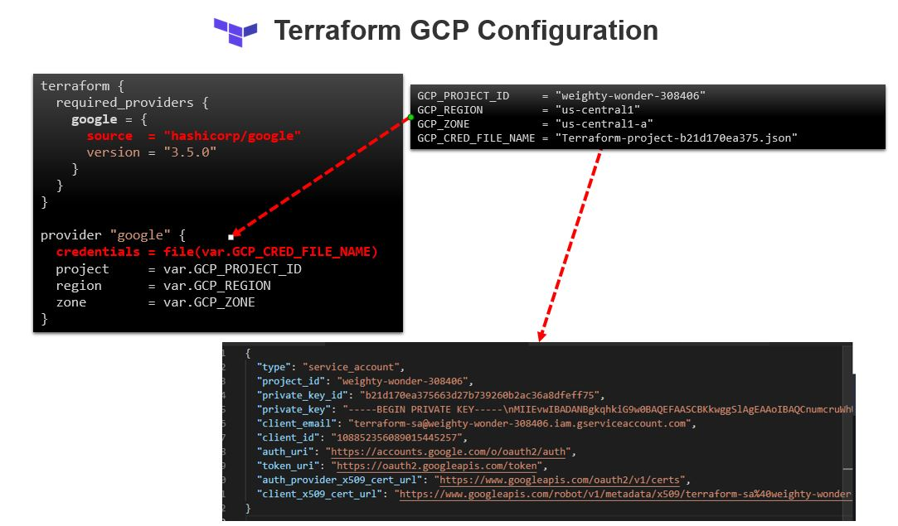

# Terraform on GCP (Google Cloud Platform)

## [Setup GCP Project and Service Account](../01-gcp-setup/README.md) 

## Terraform Configuration 

Here is the configuration for setting up CGP Provider

```sh

    terraform {
    required_providers {
        google = {
        source  = "hashicorp/google"
        version = "3.5.0"
        }
    }
    }

    provider "google" {
    credentials = file(var.GCP_CRED_FILE_NAME)
    project     = var.GCP_PROJECT_ID
    region      = var.GCP_REGION
    zone        = var.GCP_ZONE
    }

```

and Variable values are 

```sh
    GCP_PROJECT_ID     = "<<PROJECT_ID>>"
    GCP_REGION         = "us-central1"
    GCP_ZONE           = "us-central1-a"
    GCP_CRED_FILE_NAME = "<<Credential_json_file>>.json"
```




With this now we are ready to create GCP resources with Terrafrom. 


# Create first VPC

```sh

    ## Create a VPC network
    resource "google_compute_network" "terraform-network-vpc" {
    name                    = "terraform-network"
    description             = "a Test vpc Network"
    auto_create_subnetworks = false
    routing_mode            = "REGIONAL"
    }
```

# Create Public and Prviate Subnet
```sh
    ## Create a Public Subnet
    resource "google_compute_subnetwork" "us-central1-public-subnet" {
    name          = "us-central1-public-subnet"
    description   = "us-central1-public-subnet"
    ip_cidr_range = "10.0.0.0/24"
    region        = var.GCP_REGION
    network       = google_compute_network.terraform-network-vpc.id
    }

    ## Create a private Subnet
    resource "google_compute_subnetwork" "us-central1-private-subnet" {
    name          = "us-central1-private-subnet"
    description   = "us-central1-private-subnet"
    ip_cidr_range = "10.0.1.0/24"
    region        = var.GCP_REGION
    network       = google_compute_network.terraform-network-vpc.id
    }
``` 

## Create firewall Rules

```sh

    ## Create a firewall rule - allow-icmp
    resource "google_compute_firewall" "allow-icmp-custom" {
    name    = "allow-icmp-custom"
    network = google_compute_network.terraform-network-vpc.name
    allow {
        protocol = "icmp"
        
    }
    source_ranges = [ "0.0.0.0/0" ]

    priority = 65534
    source_tags = ["web"]
    }


    ## Create a firewall rule - allow-ssh
    resource "google_compute_firewall" "allow-ssh" {
    name    = "allow-icmp"
    network = google_compute_network.terraform-network-vpc.name
    
    allow {
        protocol = "tcp"
        ports    = ["22"]
    }
    source_ranges = [ "0.0.0.0/0" ]

    priority = 65534
    source_tags = ["web"]
    }

```

### VM instance for Public Subnet
```sh
    ## Create a VM instance in public subnet
    resource "google_compute_instance" "app-instance-public" {
    name         = "test-app-server"
    machine_type = "f1-micro"
    zone         = var.GCP_ZONE

    boot_disk {
        initialize_params {
        image = "debian-cloud/debian-9"
        }
    }

    network_interface {
        access_config {}
        network    = google_compute_network.terraform-network-vpc.id
        subnetwork = google_compute_subnetwork.us-central1-public-subnet.name
    }
    }

    output "test-app-server-public-nat_ip" {
    value = google_compute_instance.app-instance-public.network_interface[0].access_config[0].nat_ip
    }
    output "test-app-server-private-ip" {
    value = google_compute_instance.app-instance-public.network_interface[0].network_ip
    }
```


### VM instance for Private Subnet
```sh
    ## Create a VM instance in private subnet
    resource "google_compute_instance" "app-instance-private" {
    name         = "test-backend-server"
    machine_type = "f1-micro"
    zone         = var.GCP_ZONE

    boot_disk {
        initialize_params {
        image = "debian-cloud/debian-9"
        }
    }
    network_interface {
        network    = google_compute_network.terraform-network-vpc.id
        subnetwork = google_compute_subnetwork.us-central1-private-subnet.name
    }
    }

    output "test-backend-app-instance-private-ip" {
    value = google_compute_instance.app-instance-private.network_interface[0].network_ip
    }

```

### & finally a Router and NAT Gateway for Private subnet

```sh

    ## Create Router 
    resource "google_compute_router" "my-router" {
    name    = "my-router"
    description = "my-router"
    network = google_compute_network.terraform-network-vpc.name
    region                             = var.GCP_REGION
    }

    ## Create NAT Gateway
    resource "google_compute_router_nat" "nat" {
    name                               = "my-router-nat"
    router                             = google_compute_router.my-router.name
    region                             = var.GCP_REGION
    nat_ip_allocate_option             = "AUTO_ONLY"
    source_subnetwork_ip_ranges_to_nat = "ALL_SUBNETWORKS_ALL_IP_RANGES"
    }

```

### lets verify 

- terraform-network is created with SUBNET_MODE as CUSTOM.

```sh

    $ gcloud compute networks list
    NAME               SUBNET_MODE  BGP_ROUTING_MODE  IPV4_RANGE  GATEWAY_IPV4
    default            AUTO         REGIONAL
    terraform-network  CUSTOM       REGIONAL
```


- subnet "us-central1-subnetwork" is created in terraform-network in us-central1 region.

```sh
    $ gcloud compute networks  subnets list --filter="network:( terraform-network )"
    NAME                    REGION       NETWORK            RANGE
    us-central1-subnetwork  us-central1  terraform-network  10.0.0.0/12
```


- firewall rules , test-firewall is created under terraform-network

```sh

    $ gcloud compute firewall-rules list
    NAME                    NETWORK            DIRECTION  PRIORITY  ALLOW                         DENY  DISABLED
    default-allow-icmp      default            INGRESS    65534     icmp                                False
    default-allow-internal  default            INGRESS    65534     tcp:0-65535,udp:0-65535,icmp        False
    default-allow-rdp       default            INGRESS    65534     tcp:3389                            False
    default-allow-ssh       default            INGRESS    65534     tcp:22                              False
    test-firewall           terraform-network  INGRESS    1000      icmp,tcp:80,tcp:8080                False

```
- routes created..

```sh

    $ gcloud compute routes list --filter "network:( terraform-network )"
    NAME                            NETWORK            DEST_RANGE   NEXT_HOP                  PRIORITY
    default-route-17176df2bd80330c  terraform-network  0.0.0.0/0    default-internet-gateway  1000
    default-route-e6750b6dde623367  terraform-network  10.0.0.0/12  terraform-network         0

```

- An instance is created in the newly created vpc.

```sh 
    $ gcloud compute instances describe test-app-server --zone=us-central1-a
    canIpForward: false
    cpuPlatform: Intel Haswell
    creationTimestamp: '2021-04-01T22:36:04.313-07:00'
    deletionProtection: false
    disks:
    - autoDelete: true
    boot: true
    deviceName: persistent-disk-0
    diskSizeGb: '10'
    guestOsFeatures:
    - type: VIRTIO_SCSI_MULTIQUEUE
    index: 0
    interface: SCSI
    kind: compute#attachedDisk
    licenses:
    - https://www.googleapis.com/compute/v1/projects/debian-cloud/global/licenses/debian-9-stretch
    mode: READ_WRITE
    source: https://www.googleapis.com/compute/v1/projects/weighty-wonder-308406/zones/us-central1-a/disks/test-app-server
    type: PERSISTENT
    fingerprint: 07nk_6Xd5Fg=
    id: '5346850913645171628'
    kind: compute#instance
    labelFingerprint: 42WmSpB8rSM=
    lastStartTimestamp: '2021-04-01T22:36:20.844-07:00'
    machineType: https://www.googleapis.com/compute/v1/projects/weighty-wonder-308406/zones/us-central1-a/machineTypes/f1-micro
    metadata:
    fingerprint: aPGh8_-hArU=
    kind: compute#metadata
    name: test-app-server
    networkInterfaces:
    - fingerprint: Uy5Igpa8Po4=
    kind: compute#networkInterface
    name: nic0
    network: https://www.googleapis.com/compute/v1/projects/weighty-wonder-308406/global/networks/terraform-network
    networkIP: 10.0.0.2
    subnetwork: https://www.googleapis.com/compute/v1/projects/weighty-wonder-308406/regions/us-central1/subnetworks/us-central1-subnetwork
    scheduling:
    automaticRestart: true
    onHostMaintenance: MIGRATE
    preemptible: false
    selfLink: https://www.googleapis.com/compute/v1/projects/weighty-wonder-308406/zones/us-central1-a/instances/test-app-server
    startRestricted: false
    status: RUNNING
    tags:
    fingerprint: 42WmSpB8rSM=
    zone: https://www.googleapis.com/compute/v1/projects/weighty-wonder-308406/zones/us-central1-a
```


### Firewall Rules

[Pre-populated rules in the default network](https://cloud.google.com/vpc/docs/firewalls#more_rules_default_vpc)

The default network is pre-populated with firewall rules that allow incoming connections to instances. These rules can be deleted or modified as necessary:

**default-allow-internal** - Allows ingress connections for all protocols and ports among instances in the network. This rule has the second-to-lowest priority of 65534, and it effectively permits incoming connections to VM instances from others in the same network. This rule allows traffic in 10.128.0.0/9 (from 10.128.0.1 to 10.255.255.254), a range that covers all subnets in the network.
**default-allow-ssh** -  Allows ingress connections on TCP destination port 22 from any source to any instance in the network. This rule has a priority of 65534.
**default-allow-rdp** - Allows ingress connections on TCP destination port 3389 from any source to any instance in the network. This rule has a priority of 65534, and it enables connections to instances running the Microsoft Remote Desktop Protocol (RDP).
**default-allow-icmp** - Allows ingress ICMP traffic from any source to any instance in the network. This rule has a priority of 65534, and it enables tools such as ping.


### [Shared VPC](https://cloud.google.com/vpc/docs/shared-vpc#concepts_and_terminology)

Shared VPC connects projects within the same organization. Participating host and service projects cannot belong to different organizations. Linked projects can be in the same or different folders.


### [VPC Network Peering] (https://cloud.google.com/vpc/docs/vpc-peering)
Google Cloud VPC Network Peering allows internal IP address connectivity across two Virtual Private Cloud (VPC) networks regardless of whether they belong to the same project or the same organization.

VPC Network Peering enables you to connect VPC networks so that workloads in different VPC networks can communicate internally. Traffic stays within Google's network and doesn't traverse the public internet.