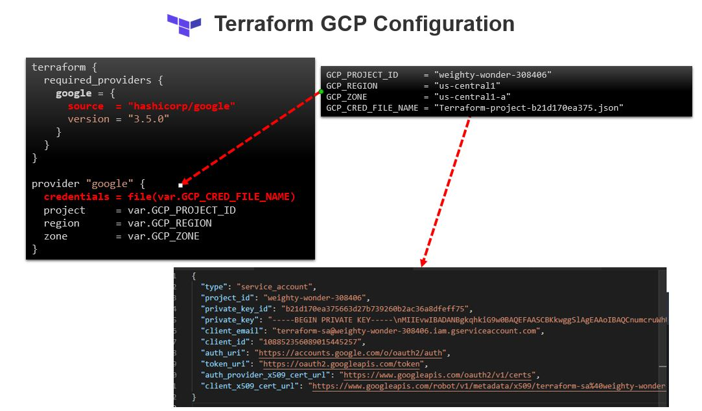

# Terraform on GCP (Google Cloud Platform)

## [Setup GCP Project and Service Account](../01-gcp-setup/README.md) 

## Terraform Configuration 

Here is the configuration for setting up CGP Provider

```sh

    terraform {
    required_providers {
        google = {
        source  = "hashicorp/google"
        version = "3.5.0"
        }
    }
    }

    provider "google" {
    credentials = file(var.GCP_CRED_FILE_NAME)
    project     = var.GCP_PROJECT_ID
    region      = var.GCP_REGION
    zone        = var.GCP_ZONE
    }

```

and Variable values are 

```sh
    GCP_PROJECT_ID     = "<<PROJECT_ID>>"
    GCP_REGION         = "us-central1"
    GCP_ZONE           = "us-central1-a"
    GCP_CRED_FILE_NAME = "<<Credential_json_file>>.json"
```




With this now we are ready to create GCP resources with Terrafrom. 


# Create VPC

```sh

    ## Create a VPC network
    resource "google_compute_network" "terraform-network-vpc" {
    name                    = "terraform-network"
    description             = "a Test vpc Network"
    auto_create_subnetworks = false
    routing_mode            = "REGIONAL"
    }
```

# Create Public and Prviate Subnet
```sh
    ## Create a private Subnet
    resource "google_compute_subnetwork" "us-central1-private-subnet" {
    name          = "us-central1-private-subnet"
    description   = "us-central1-private-subnet"
    ip_cidr_range = "10.0.1.0/24"
    region        = var.GCP_REGION
    network       = google_compute_network.terraform-network-vpc.id
    }
``` 

## Create firewall Rules

```sh

    ## Create a firewall rule - allow-icmp
    resource "google_compute_firewall" "allow-icmp-custom" {
    name    = "allow-icmp-custom"
    network = google_compute_network.terraform-network-vpc.name
    allow {
        protocol = "icmp"
        
    }
    source_ranges = [ "0.0.0.0/0" ]

    priority = 65534
    source_tags = ["web"]
    }


    ## Create a firewall rule - allow-ssh
    resource "google_compute_firewall" "allow-ssh" {
    name    = "allow-icmp"
    network = google_compute_network.terraform-network-vpc.name
    
    allow {
        protocol = "tcp"
        ports    = ["22"]
    }
    source_ranges = [ "0.0.0.0/0" ]

    priority = 65534
    source_tags = ["web"]
    }

```

### A Router and NAT Gateway for Private subnet to access the internet

```sh

    ## Create Router 
    resource "google_compute_router" "my-router" {
    name    = "my-router"
    description = "my-router"
    network = google_compute_network.terraform-network-vpc.name
    region                             = var.GCP_REGION
    }

    ## Create NAT Gateway
    resource "google_compute_router_nat" "nat" {
    name                               = "my-router-nat"
    router                             = google_compute_router.my-router.name
    region                             = var.GCP_REGION
    nat_ip_allocate_option             = "AUTO_ONLY"
    source_subnetwork_ip_ranges_to_nat = "ALL_SUBNETWORKS_ALL_IP_RANGES"
    }
```

### An Instance Template 

```sh

    ## Instance Template 
    resource "google_compute_instance_template" "terraform-maintained-it" {
    name        = "terraform-maintained-instance-template"
    description = "instance Template maintained by Terraform"

    network_interface {
        network    = google_compute_network.terraform-network-vpc.id
        subnetwork = google_compute_subnetwork.us-central1-private-subnet.name
    }
    machine_type = "f1-micro"
    disk {
        source_image = "debian-10"
        auto_delete  = true
        disk_size_gb = 10
    }

    metadata_startup_script = data.template_file.nginx.rendered
    instance_description    = "instance maintained by Terraform"
    can_ip_forward          = false

    labels = {
        environment = "dev"
    }

    scheduling {
        automatic_restart = false
    }
    }

```

### And an instance group manager with Instance Template.

```sh

    ### create an instance group manager with Instance Template 
    resource "google_compute_instance_group_manager" "terraform-maintained-ig" {
    name               = "terraform-maintained-ig"
    description        = "terraform Maintained Instance Group"
    zone               = var.GCP_ZONE
    project            = var.GCP_PROJECT_ID
    base_instance_name = "terraform-maintained"

    version {
        instance_template = google_compute_instance_template.terraform-maintained-it.id
    }
    target_size = 1
    }


```


### [Viewing startup script logs](https://cloud.google.com/compute/docs/startupscript#viewing_startup_script_logs)

Startup script output is written to the following log files:

- CentOS and RHEL: /var/log/messages
- Debian: /var/log/daemon.log
- Ubuntu: /var/log/syslog
- SLES: /var/log/messages

**You can also use the journalctl command to view startup script output.**


### lets verify 

- terraform-network is created with SUBNET_MODE as CUSTOM.

```sh
    $ gcloud compute networks list
    NAME               SUBNET_MODE  BGP_ROUTING_MODE  IPV4_RANGE  GATEWAY_IPV4
    default            AUTO         REGIONAL
    terraform-network  CUSTOM       REGIONAL
    test-vpc-network   CUSTOM       REGIONAL
```

- subnet "us-central1-subnetwork" is created in terraform-network in us-central1 region.