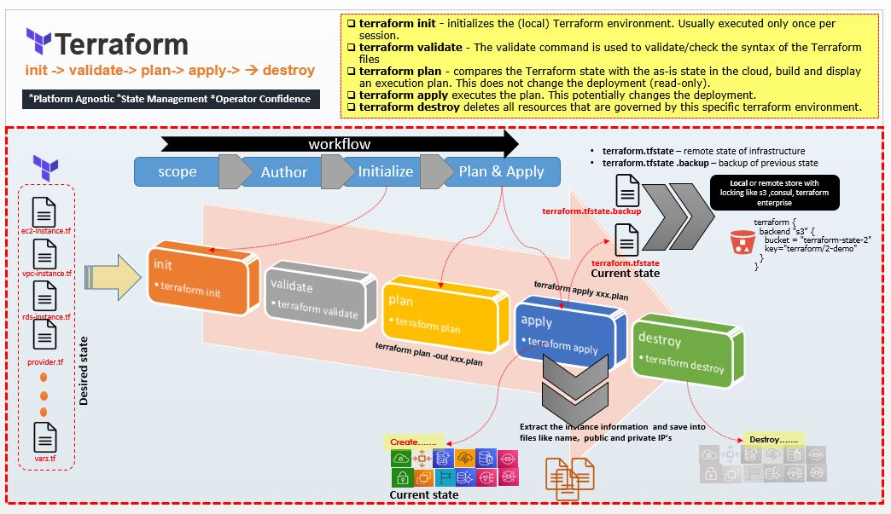

# [Terraform](https://www.terraform.io/intro/index.html)


## What is Terraform

Terraform is an open source “Infrastructure as Code” tool, created by HashiCorp.

A declarative coding tool, Terraform enables developers to use a high-level configuration language called HCL (HashiCorp Configuration Language) to describe the desired “end-state” cloud or on-premises infrastructure for running an application. It then generates a plan for reaching that end-state and executes the plan to provision the infrastructure.

Terraform is a tool to build out server infrastructure through code, sometimes called Infrastructure as Code. This allows you to define your entire infrastructure with code for repeatable and consistent builds. Terraform can be used to deploy vm's, storage, networking, DNS, load Balancers and more with cloud infrastructure providers like AWS and Azure among others.

Cloud providers like AWS and Azure have their own way to define infrastructure as code with CloudFormation and Azure Resource Manager (ARM) templates. Terraform takes this a step further and can manage multiple cloud providers in one configuration.

Terraform uses its own configuration language called "Terraform Language" which is based off of HCL.

## Why Infrastructure as Code (IaC)?
IaC allows developers to codify infrastructure in a way that makes provisioning automated, faster, and repeatable. It’s a key component of Agile and DevOps practices such as version control, continuous integration, and continuous deployment.

Infrastructure as code can help with the following:

- **Improve speed**: Automation is faster than manually navigating an interface when you need to deploy and/or connect resources.

- **Improve reliability**: If your infrastructure is large, it becomes easy to misconfigure a resource or provision services in the wrong order. With IaC, the resources are always provisioned and configured exactly as declared.

- **Prevent configuration drift**: Configuration drift occurs when the configuration that provisioned your environment no longer matches the actual environment. (See ‘Immutable infrastructure’ below.)

- **Support experimentation, testing, and optimization**: Because Infrastructure as Code makes provisioning new infrastructure so much faster and easier, you can make and test experimental changes without investing lots of time and resources; and if you like the results, you can quickly scale up the new infrastructure for production.


## Why Terraform?
There are a few key reasons developers choose to use Terraform over other Infrastructure as Code tools:

- **Open source**: Terraform is backed by large communities of contributors who build plugins to the platform. Regardless of which cloud provider you use, it’s easy to find plugins, extensions, and professional support. This also means Terraform evolves quickly, with new benefits and improvements added consistently.
- **Platform agnostic**: Meaning you can use it with any cloud services provider. Most other IaC tools are designed to work with single cloud provider.
- **Immutable infrastructure**: Most Infrastructure as Code tools create mutable infrastructure, meaning the infrastructure can change to accommodate changes such as a middleware upgrade or new storage server. The danger with mutable infrastructure is configuration drift—as the changes pile up, the actual provisioning of different servers or other infrastructure elements ‘drifts’ further from the original configuration, making bugs or performance issues difficult to diagnose and correct. Terraform provisions immutable infrastructure, which means that with each change to the environment, the current configuration is replaced with a new one that accounts for the change, and the infrastructure is reprovisioned. Even better, previous configurations can be retained as versions to enable rollbacks if necessary or desired.


## Popular IaC Tools:

- **Terraform** An open-source declarative tool that offers pre-written modules to build and manage an infrastructure.
- **Chef**: A configuration management tool that uses cookbooks and recipes to deploy the desired environment. Best used for Deploying and configuring applications using a pull-based approach.
- **Puppet**: Popular tool for configuration management that follows a Client-Server Model. Puppet needs agents to be deployed on the target machines before the puppet can start managing them.
- **Ansible**: Ansible is used for building infrastructure as well as deploying and configuring applications on top of them. Best used for Ad hoc analysis.
- **Packer**: Unique tool that generates VM images (not running VMs) based on steps you provide. Best used for Baking compute images.
- **Vagrant**: Builds VMs using a workflow. Best used for Creating pre-configured developer VMs within VirtualBox.

## Terraform vs. Ansible

- Terraform and Ansible are both Infrastructure as Code tools, but there are a couple significant differences between the two:

- While Terraform is purely a declarative tool , Ansible combines both declarative and procedural configuration. 
- In procedural configuration, you specify the steps, or the precise manner, in which you want to provision infrastructure to the desired   state. Procedural configuration is more work but it provides more control.
- Terraform is open source; Ansible is developed and sold by Red Hat.
- Terraform is not fit to do configuration management on the software on your machines. 
- Ansible/Chef/Puppet/Salt are better alternatives to do that. 
- Terraform can work together with these tools to provide you CI on your machines. 
- Terraform provides Configuration Management on an infrastructure level, not on the level of software of your machines.




## Troubleshooting tips

### [1] Troubleshooting tips  

If you see below error it means you need to create a new set of key pair and AWS might have invalidate it because of various reasons.

```
    Error: error configuring Terraform AWS Provider: error validating provider credentials: error calling sts:GetCallerIdentity: InvalidClientTokenId: The security token included in the request is invalid.
            status code: 403,
```

## git ignore


- Follow the Git Ignore from [link](https://github.com/github/gitignore/blob/master/Terraform.gitignore)


## Before you try examples...  

-  [Terraform Basics](./terrform-basics.md)

-  [Terraform Commands](./terraform-commands.md)

-  [Terraform AWS Demo](./aws-terraform-example.md)

## Examples [AWS]

- [01-provider-version-test](./01-provider-version-test/README.md)

   
    1. How the different provider's can be setup
    2. How the provider's versioning work.
    3. Location where providers are downloaded 

- [02-variables](./02-variables/README.md)

    1. How to configure variable. 
    2. How to use MAP to get the AMI for a specific region.
    3. How to use MAP to create tags.
    4. How to use LIST for storing cider's. 
    5. How to use dynamic blocks in security group for the multiple entires for ingress port.
    6. How to use count and terraform splat expression.
    7. How to use custom.tfvars. 


- [03-datasource](./03-datasource/README.md)

    1. What is data source.
    2. How to use data source to pull the free tire AMI list for EC2 instance. 

- [04-provisioner](./04-provisioner/README.md)

    1. What is provisioner?
    2. Local and Remote Provisioner.
    3. inline commands with Provisioner.
    4. Creation time and Destory Time Provisioner.
    5. Failure Behavior for Provisioner.

- [05-modules](./05-modules/README.md)

    1. What is modules and Terraform Registry?
    2. How to configure Module Source .
    3. How to create simple module and use it.
    4. How to use the ouput variable from module.
    
- [06-terraform-state](./06-terraform-state/README.md)

    1. How to configure S3 as remote state.
    

- [07-terraform-state-import](./07-terraform-state-import/README.md)

    1. How to import state for manually created instance.
    
- [08-terraform-multi-region-provider](./08-terraform-multi-region-provider/README.md)

    1. How configure and use terraform provider for multiple region using alias 
    2. How configure and use terraform provider for multiple account using alias

- [09-terraform-cloud-demo](./09-terraform-cloud-demo/README.md)

    1. Simple file for demo the flow of Terraform Cloud.

- [010-github-demo](./010-github-demo/README.md)

    1. Demo to create git repo with terraform

- [011-aws-create-s3](./011-aws-create-s3/README.md)

    1. Demo to create s3 bucket with terraform.

- [012-aws-ec2](./012-aws-ec2/README.md)

    1. Demo to create ec2 instance with terraform and associate them with security group.
    2. Demo to create security group.

- [013-aws-ec2-state-s3](./013-aws-ec2-state-s3/README.md)

    1. Demo to create ec2 instance with terraform and associate them with security group.
    2. Demo to create security group.
    3. Demo to configure S3 as Remote state.

- [014-aws-ec2-workspace](./014-aws-ec2-workspace/README.md)

    1. What is a Workspace?
    2. Demo to create and delete workspace like DEV/UAT & PROD
    
- [015-aws-ec2-maria-db](./015-aws-ec2-maria-db/README.md)

    1. Demo to create EC2 instance and Mariab DB

- [016-aws-install-jenkins](./016-aws-install-jenkins/README.md)

    1. Demo to create EC2 instance with Jenkins installed

- [017-aws-online-portal](./017-aws-online-portal/README.md)

    1. Demo to create infrasture of a dummy online-portal where we have VPC, Internet Gateway , route tables, 
    autoscaling groups, security groups , user_data, public and private subnet... 

- [018-aws-modules](./018-aws-modules/README.md)

    1. Demo to create infrasture of a dummy online-portal using module where we have VPC, Internet Gateway , route tables, autoscaling groups, security groups , user_data, public and private subnet... 


## Examples [GCP]

- [01-gcp-setup](./01-gcp-setup/README.md)

    1. How the setup GCP provider's and required configuration
    2. Create a VM instance , VPC and Storage Bucket 
