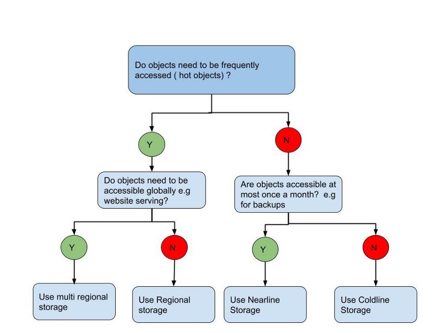

## gsutil - 




### create a bucket

```

    $ gsutil mb  gs://sumitgupta28-123456789
    Creating gs://sumitgupta28-123456789/...

    $ gsutil ls
    gs://sumitgupta28-123456789/

```

### get bucket versioning

```
    $ gsutil versioning get gs://sumitgupta28-123456789/
    gs://sumitgupta28-123456789: Suspended

```

### set bucket versioning on 

```
    $ gsutil versioning set on gs://sumitgupta28-123456789/
    Enabling versioning for gs://sumitgupta28-123456789/...


    $ gsutil versioning get gs://sumitgupta28-123456789/
    gs://sumitgupta28-123456789: Enabled

```

### set bucket versioning off 
```
    $ gsutil versioning set off gs://sumitgupta28-123456789/
    Suspending versioning for gs://sumitgupta28-123456789/...

    $ gsutil versioning get gs://sumitgupta28-123456789/
    gs://sumitgupta28-123456789: Suspended

```

### add a file 

```

    $ cat Test.json
    {"name":"Sumit"}


    $ gsutil cp  Test.json  gs://sumitgupta28-123456789/
    Copying file://Test.json [Content-Type=application/json]...
    / [1 files][   17.0 B/   17.0 B]
    Operation completed over 1 objects/17.0 B.

```

### read file 
```
    $ gsutil cat gs://sumitgupta28-123456789/Test.json
    {"name":"Sumit"}
```


### See all the versions if versioning enabled. 

```sh
    -- Create a bucket
    $ gsutil mb gs://sumitgupta28-test-bukect
    Creating gs://sumitgupta28-test-bukect/...

    --- enable versioning 
    $ gsutil versioning set on  gs://sumitgupta28-test-bukect
    Enabling versioning for gs://sumitgupta28-test-bukect/...

    --- Copy a version of Test.json
    $ gsutil cp  Test.json gs://sumitgupta28-test-bukect/
    Copying file://Test.json [Content-Type=application/json]...
    / [1 files][   17.0 B/   17.0 B]
    Operation completed over 1 objects/17.0 B.


    --- Copy another version of Test.json
    $ gsutil cp  Test.json gs://sumitgupta28-test-bukect/
    Copying file://Test.json [Content-Type=application/json]...
    / [1 files][   17.0 B/   17.0 B]
    Operation completed over 1 objects/17.0 B.


    --- Copy another version of Test.json
    $ gsutil cp  Test.json gs://sumitgupta28-test-bukect/
    Copying file://Test.json [Content-Type=application/json]...
    / [1 files][   17.0 B/   17.0 B]
    Operation completed over 1 objects/17.0 B.

    --- Basic ls 
    $ gsutil ls gs://sumitgupta28-test-bukect/
    gs://sumitgupta28-test-bukect/Test.json

    --- ls all the versions 
    gsutil ls -a gs://sumitgupta28-test-bukect/
    gs://sumitgupta28-test-bukect/Test.json#1618816097081524
    gs://sumitgupta28-test-bukect/Test.json#1618816099711201
    gs://sumitgupta28-test-bukect/Test.json#1618816202162925


    --- View specific version of document 
    $ gsutil cat  gs://sumitgupta28-test-bukect/Test.json#1618816097081524
    {"name":"Sumit"}
    $ gsutil cat  gs://sumitgupta28-test-bukect/Test.json#1618816099711201
    {"name":"Sumit"}
    $ gsutil cat  gs://sumitgupta28-test-bukect/Test.json#1618816202162925
    {"name":"Sumit Gupta"}

    --- now set the versioning off 
    $ gsutil versioning set off gs://sumitgupta28-test-bukect
    Suspending versioning for gs://sumitgupta28-test-bukect/...

    --- again upload a new version of document 
    $ gsutil cp  Test.json gs://sumitgupta28-test-bukect/
    Copying file://Test.json [Content-Type=application/json]...
    / [1 files][   30.0 B/   30.0 B]
    Operation completed over 1 objects/30.0 B.

    --- ls all the versions 
    $ gsutil ls -a gs://sumitgupta28-test-bukect/
    gs://sumitgupta28-test-bukect/Test.json#1618816097081524
    gs://sumitgupta28-test-bukect/Test.json#1618816099711201
    gs://sumitgupta28-test-bukect/Test.json#1618816560385280

    --- see the latest file with version 
    $ gsutil cat gs://sumitgupta28-test-bukect/Test.json#1618816560385280
    {"name":"Sumit Kumar Gupta "}

    --- see the latest file without version 
    $ gsutil cat gs://sumitgupta28-test-bukect/Test.json
    {"name":"Sumit Kumar Gupta "}

```

### Delete 
```

    $ gsutil rm gs://sumitgupta28-123456789/Test.json
    Removing gs://sumitgupta28-123456789/Test.json...
    / [1 objects]
    Operation completed over 1 objects.


    $ gsutil rm -r gs://sumitgupta28-123456789
    Removing gs://sumitgupta28-123456789/Test.json#1618730252777241...
    Removing gs://sumitgupta28-123456789/Test.json#1618730257228865...
    / [2 objects]
    Operation completed over 2 objects.
    Removing gs://sumitgupta28-123456789/...

```

### Changing object storage classes

```
    $ gsutil rewrite -s STORAGE_CLASS gs://PATH_TO_OBJECT
```

### List all the files versions
```sh

    $ gsutil ls -a gs://sumit-28061984
    gs://sumit-28061984/Test.json#1619759169095599
    gs://sumit-28061984/text.txt#1619759361139294
    gs://sumit-28061984/text.txt#1619759396945577
```

### List all the files version with generation and metageneration numbers. 

```sh

    $ gsutil ls -al gs://sumit-28061984
        30  2021-04-30T05:06:09Z  gs://sumit-28061984/Test.json#1619759169095599  metageneration=1
         6  2021-04-30T05:09:21Z  gs://sumit-28061984/text.txt#1619759361139294  metageneration=1
         8  2021-04-30T05:09:57Z  gs://sumit-28061984/text.txt#1619759396945577  metageneration=1
    TOTAL: 3 objects, 44 bytes (44 B)

```

### stats commoand

```sh
    $ gsutil stat gs://sumit-28061984/Test.json
    gs://sumit-28061984/Test.json:
        Creation time:          Fri, 30 Apr 2021 05:06:09 GMT
        Update time:            Fri, 30 Apr 2021 05:20:45 GMT
        Storage class:          STANDARD
        Content-Length:         30
        Content-Type:           application/json
        Metadata:
            icecreamflavor:     vanilla
        Hash (crc32c):          JXru/w==
        Hash (md5):             cGAc+RH8zAiyaoOlW0dW0Q==
        ETag:                   CK+PlY+ZpfACEAI=
        Generation:             1619759169095599
        Metageneration:         2
```