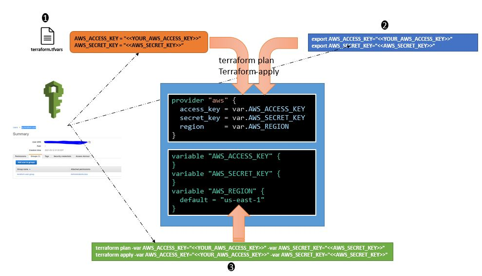

## How to Run the examples

Provide **AWS_ACCESS_KEY** and **AWS_SECRET_KEY** as input to terraform



### Method#1 using terraform.tfvars
> Create a new file **terraform.tfvars** with below content inside the project folder

```sh
    AWS_ACCESS_KEY = "<<YOUR_AWS_ACCESS_KEY>>"
    AWS_SECRET_KEY = "<<AWS_SECRET_KEY>>" 
```

### Method#2 using env variables.

```sh
export AWS_ACCESS_KEY="<<YOUR_AWS_ACCESS_KEY>>"
export AWS_SECRET_KEY="<<AWS_SECRET_KEY>>"
```

### Method#3 input as var to terraform commands

```sh
terraform plan -var AWS_ACCESS_KEY="<<YOUR_AWS_ACCESS_KEY>>" -var AWS_SECRET_KEY="<<AWS_SECRET_KEY>>"
terraform apply -var AWS_ACCESS_KEY="<<YOUR_AWS_ACCESS_KEY>>" -var AWS_SECRET_KEY="<<AWS_SECRET_KEY>>"
```

### Method#4 use the aws cli configuration. 

- step 1, remove AWS_ACCESS_KEY/AWS_SECRET_KEY ref from **vars.tf** and **provider.tf**
- step 2, perfrom aws cli configuration.